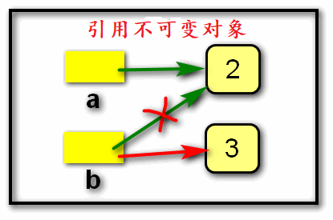
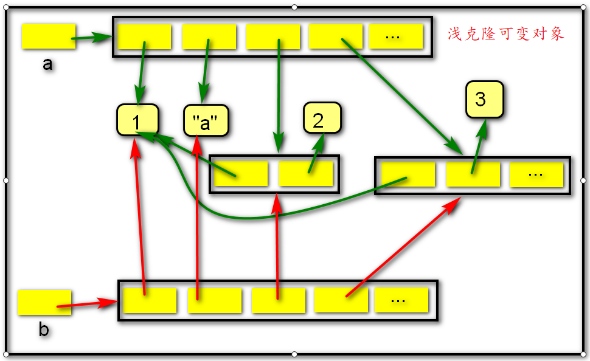
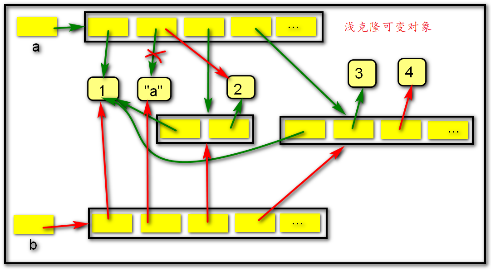

# 技术晨讲-向松

## 1. Python 里的拷贝？理解引用和 copy(),deepcopy()的区别。

- **引用**：通过 ‘=’将一个变量的引用**赋值**给一个新变量，两个变量指向同一片内存空间。

  - 引用对象为不可变类型，如数值型，字符串，元组时，新变量值的改变不会影响原来的变量值。

    ```python
    from copy import *
    a=2
    b=a
    print(f"a的地址：{id(a)}\tb的地址：{id(b)}")
    
    # 结果
    a的地址：1654156384	b的地址：1654156384
    
    b=b+1
    print(f"a:{a},b:{b}")
    print(f"a的地址：{id(a)}\tb的地址：{id(b)}")
    
    # 结果
    a:2,b:3
    a的地址：1654156384	b的地址：1654156416
    ```

    

  - 引用对象为可变对象类型时，如列表，字典，集合，新变量的值发生变化时，原来的变量的值也会跟着改变（对象中的元素发生改变）。

    ```python
    a=[1,"a",(1,2),[1,3]]
    b=a
    b[0]=2
    b.append(3)
    b[2]=4
    print(f"a:{a} b:{b}")
    print(f"a的地址:{id(a)}  b的地址:{id(b)}")
    
    # 结果
    a:[2, 'a', 4, [1, 3], 3] b:[2, 'a', 4, [1, 3], 3]
    a的地址:107199432  b的地址:107199432
    ```

  

- **浅克隆copy():**

  - 当浅克隆copy()的对象是不可变类型时，和引用赋值一样。

    ```python
    a="hello"
    b=copy(a)
    print(f"a:{a} b:{b}")
    print(f"a的地址:{id(a)}  b的地址:{id(b)}")
    
    # 结果
    a:hello b:hello
    a的地址:94634032  b的地址:94634032
            
    b="python"
    print(f"a:{a} b:{b}")
    print(f"a的地址:{id(a)}  b的地址:{id(b)}")
    
    # 结果
    a:hello b:python
    a的地址:94634032  b的地址:54190352
    ```

    

  - 当浅克隆copy()的对象是可变类型时，只会复制浅层，即新变量会重新开辟一片同样大小的内存，但是新变量引用的对象中的第一层元素的地址和原来一样。

    ```python
    a=[1,"a",(1,2),[1,3]]
    b=copy(a)
    print(f"a:{a} b:{b}")
    print(f"a的地址:{id(a)}  b的地址:{id(b)}")
    print(f"a[0]地址:{id(a[0])}  b[0]地址:{id(b[0])}")
    print(f"a[1]地址:{id(a[1])}  b[1]地址:{id(b[1])}")
    print(f"a[2]地址:{id(a[2])}  b[0]地址:{id(b[2])}")
    print(f"a[0]地址:{id(a[3])}  b[0]地址:{id(b[3])}")
    
    # 结果
    a:[1, 'a', (1, 2), [1, 3]] b:[1, 'a', (1, 2), [1, 3]]
    a的地址:107310536  b的地址:85621448
    a[0]地址:1654156352  b[0]地址:1654156352
    a[1]地址:30998400  b[1]地址:30998400
    a[2]地址:85466504  b[0]地址:85466504
    a[0]地址:107307848  b[0]地址:107307848
    ```

    

    - 浅克隆的对象中没有可变类型子对象时，改变新对象中元素的值，原始对象的值不变。
    - 浅克隆的对象中有可变类型子对象时，改变该可变类型子对象中的元素值时，原始对象中对应的子对象的值也会跟着改变。

    ```python
    a.append(3)
    a[1]=2
    a[3].append(4)
    print(f"a:{a} b:{b}")
    
    # 结果
    a:[1, 2, (1, 2), [1, 3, 4], 3] b:[1, 'a', (1, 2), [1, 3, 4]]
    ```

  

- 深克隆deepcopy()：对克隆对象中的所有层进行拷贝，即逐层对所有子对象（包括可变类型子对象）进行拷贝，所以改变原有被复制对象不会对已经复制出来的新对象产生影响。

  ```python
  a=[1,"a",(1,2),[1,3]]
  b=deepcopy(a)
  print(f"a:{a} b:{b}")
  a.append(3)
  a[1]=2
  a[3].append(4)
  print(f"a:{a} b:{b}")
  
  # 结果
  a:[1, 'a', (1, 2), [1, 3]] b:[1, 'a', (1, 2), [1, 3]]
  a:[1, 2, (1, 2), [1, 3, 4], 3] b:[1, 'a', (1, 2), [1, 3]]
  ```
  
  

## 2. Python 垃圾回收机制？

**Python的垃圾回收机制主要有三个方面：**

- **引用计数**

引用计数的原理就是，系统会记录每个对象被引用的次数，当指向该对象的内存的引用计数器为0的时候，该内存将会被Python虚拟机销毁。

当发生以下四种情况的时候，该对象的引用计数器**+1**：

	1. 对象被创建  a=14
 	2. 对象被引用  b=a
 	3. 对象被作为参数,传到函数中   func(a)
 	4. 对象作为一个元素，存储在容器中   List={a：”a”,”b”：2}

与上述情况相对应，当发生以下四种情况时，该对象的引用计数器**-1**：

	1. 当该对象的别名被显式销毁时	del a
 	2. 当该对象的引别名被赋予新的对象    a=26
 	3. 一个对象离开它的作用域，例如 func函数执行完毕时，函数里面的局部变量的引用计数器就会减一
 	4. 将该元素从容器中删除时，或者容器被销毁时。

**原始的引用计数法无法解决循环引用的问题**

A和B相互引用而再没有外部引用A与B中的任何一个，这意味着不会再有人使用这组对象，应该回收这组对象所占用的内存空间，然后由于相互引用的存在，每一个对象的引用计数都为1，因此这些对象所占用的内存永远不会被释放。比如：

```python
a ``=` `[]
b ``=` `[]
a.append(b)
b.append(a)
```

为了解决这个问题，Python引入了其他的垃圾收集机制来弥补引用计数的缺陷：“标记-清除”，“分代回收”两种收集技术。

- **标记-清除**

  解决循环引用问题

- **分代回收**

  分代回收是一种以空间换时间的操作方式，Python将内存根据对象的存活时间划分为不同的集合，每个集合称为一个代，Python将内存分为了3“代”，分别为年轻代（第0代）、中年代（第1代）、老年代（第2代）。他们对应的是3个链表，它们的垃圾收集频率与对象的存活时间的增大而减小。新创建的对象都会分配在年轻代，年轻代链表的总数达到上限时，Python垃圾收集机制就会被触发，把那些可以被回收的对象回收掉，而那些不会回收的对象就会被移到中年代去，依此类推，老年代中的对象是存活时间最久的对象，甚至是存活于整个系统的生命周期内。同时，分代回收是建立在标记清除技术基础之上。

## 3. 什么是 lambda 函数？它有什么好处?

1. 定义：是一种匿名函数。
2. 用途：一般在函数式编程中，lambda表达式作为参数，配合map()，filter()等高阶函数使用。
3. 好处：lambda函数比较轻便，即用即仍，很适合需要完成一项功能，但是此功能只在此一处使用，连名字都很随意的情况下。

3. 语法

   ```python
   -- 定义：
   变量 = lambda 形参: 方法体
   -- 调用：
   	变量(实参)
   ```

4. 说明：

   -- 形参没有可以不填

   -- 方法体只能有一条语句，且不支持赋值语句。

例如：

1. 要将列表 a=[1,2,3,4,5,6,7,8,9]中的所有元素求平方。使用lambda和map函数可以一行代码搞定。

   ```python
   print(list(map(lambda x:x**2,a)))
   
   #结果
   [1, 4, 9, 16, 25, 36, 49, 64, 81]
   ```

2. 取出列表a中的奇数或者偶数。

   ```python
   print(list(filter(lambda x:x%2==1,a)))
   print(list(filter(lambda x:x%2==0,a)))
   
   # 结果
   [1, 3, 5, 7, 9]
   [2, 4, 6, 8]
   ```

   