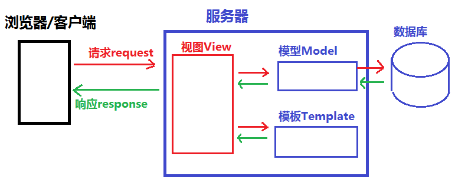

#  《Django Web框架教学笔记》
### 目录
[TOC]

- 课程特点：
    1. 学习难度大，大部分内容需要理解并记忆
    2. 文件较多易混淆
    3. 学习阶段注重框架使用，工作阶段注重实现业务逻辑
    4. 综合应用强，小练习少

# day01

## Django框架的介绍

### 起源&现状

- 2005年发布,采用Python语言编写的开源web框架
- 早期的时候Django主做新闻和内容管理的
- 一个重量级的 Python Web框架，Django 配备了常用的大部分组件
    1. 基本配置
    1. 路由系统
    1. 原生HTML模板系统
    1. 视图 view
    1. Model模型,数据库连接和ORM数据库管理
    1. 中间件
    1. Cookie & Seesion
    1. 分页
    1. 数据库后台管理系统admin

- Django的用途
    - 网站后端开发
    - 微信公众号、微信小程序等后台开发
    - 基于HTTP/HTTPS协议的后台服务器开发
        - 在线语音/图像识别服务器
        - 在线第三方身份验证服务器等
- Django的版本
    - 最新版本:3.0.x
    - 当前教学版本:2.2.12

- Django的官网
    - 官方网址: <http://www.djangoproject.com>
    - 中文文档(第三方):
        - <https://yiyibooks.cn/>


### Django的安装
- 查看已安装的版本
    ```python
    >>> import django
    >>> print(django.VERSION)
    (2, 2, 12, 'final', 0)
    ```
- 安装
    1. 在线安装
        - `$ sudo pip3 install django`  安装django的最新版本
        - 或
        - `$ sudo pip3 install django[==版本]` 安装django的指定版本
        - 如:
            - `$ sudo pip3 install django==2.2.12
    2. 离线安装
        - 下载安装包:
        - 安装离线包
            - `$ tar -xvf Django-2.2.12.tar.gz`
            - `$ cd Django-2.2.12`
            - `$ sudo python3 setup.py install`
- Django的卸载
  
- $ pip3 uninstall django
  
- Django 的开发环境
    - Django 2.2.12 支持 3.5，3.6，3.7，3.8
    
      

## 创建Django项目
### 创建项目的指令
  - $ django-admin startproject 项目名称
  - 如:
    
    - $ django-admin startproject mysite1
  - 运行
    ```shell
    $ cd mysite1
    $ python3 manage.py runserver
    # 或
    $ python3 manage.py runserver 5000  # 指定只能本机使用127.0.0.1的5000端口访问本机
    ```
### Django项目的目录结构
- 示例:
    ```shell
    $ django-admin startproject mysite1
    $ tree mysite1/
    mysite1/
    ├── manage.py
    └── mysite1
        ├── __init__.py
        ├── settings.py
        ├── urls.py
        └── wsgi.py

    1 directory, 5 files
    ```
    
- 项目目录结构解析:
    - manage.py
        - 此文件是项目管理的主程序,在开发阶段用于管理整个项目的开发运行的调式
        - `manage.py` 包含项目管理的子命令, 如:
            - `python3 manage.py runserver` 启动服务
            - `python3 manage.py startapp` 创建应用
            - `python3 manage.py migrate` 数据库迁移
            - `...`
    - mysite1 项目文件夹
        - 项目包的主文件夹(默认与项目名称一致)
        1. `__init__.py`
            - 包初始化文件,当此项目包被导入(import)时此文件会自动运行
        2. `wsgi.py`
            - WSGI 即 Web Server Gateway Interface
            - WEB服务网关接口的配置文件，仅部署项目时使用
        3. `urls.py`
            - 项目的主路由配置文件，所有的动态路径必须先走该文件进行匹配
        4. `settings.py`
            - Django项目的配置文件, 此配置文件中的一些全局变量将为Django框架的运行传递一些参数
            - setting.py 配置文件,启动服务时自动调用，
            - 此配置文件中也可以定义一些自定义的变量用于作用全局作用域的数据传递


### `settings.py` 文件介绍

https://docs.djangoproject.com/en/2.2/ref/settings/

1. `BASE_DIR`
   
    - 用于绑定当前项目的绝对路径(动态计算出来的), 所有文件都可以依懒此路径
2. `DEBUG`
   
    - 用于配置Django项目的启动模式, 取值:
        1. True 表示开发环境中使用 `调试模式`(用于开发中)
        2. False 表示当前项目运行在`生产环境中`(不启用调试)
3. `ALLOWED_HOSTS`
   
    - 设置允许访问到本项目的host请求头的值,取值:
        1. [] 空列表,表示只有host请求头为`127.0.0.1`, `localhost`能访问本项目 - DEBUG = True时生效
        2. ['*']，表示任何请求头的host都能访问到当前项目
        3. ['192.168.1.3', '127.0.0.1'] 表示只有当前两个host头的值能访问当前项目
        - 注意:
            - 如果要在局域网其它主机也能访问此主机,启动方式应使用如下模式:
    - `python3 manage.py runserver 0.0.0.0:5000` # 指定网络设备如果内网环境下其他主机想正常访问该站点，需加`ALLOWED_HOSTS = ['内网ip'] 
    
4. `INSTALLED_APPS`
   
    - 指定当前项目中安装的应用列表
5. `MIDDLEWARE`
   
    - 用于注册中间件
6. `TEMPLATES`
   
    - 用于指定模板的配置信息
7. `DATABASES`
   
    - 用于指定数据库的配置信息
8. `LANGUAGE_CODE`
   
    - 用于指定语言配置
    - 取值:
        - 英文 : `"en-us"`
        - 中文 : `"zh-Hans"`
9. `TIME_ZONE`
   
    - 用于指定当前服务器端时区
    - 取值:
        - 世界标准时间: `"UTC"`
        - 中国时区 : `"Asia/Shanghai"`
10. `ROOT_URLCONF`
    
    - 用于配置根级 url 配置 'mysite1.urls'
    - 如:
        - `ROOT_URLCONF = 'mysite1.urls'`
> 注: 此模块可以通过 `from django.conf import settings` 导入和使用

## URL 介绍

### URL定义

- URL 即统一资源定位符 Uniform Resource Locator
- 作用:
  
    - 用来表示互联网上某个资源的地址。
- 说明:
  
    - 互联网上的每个文件都有一个唯一的URL，它包含的信息指出文件的位置以及浏览器应该怎么处理它。
- URL的一般语法格式为：
    ```
    protocol :// hostname[:port] / path [?query][#fragment]
    ```
- 如:
    ```
    http://tts.tmooc.cn/video/showVideo?menuId=657421&version=AID201908#subject
    ```

- 说明:
    - protocol（协议）
        - http 通过 HTTP 访问该资源。 格式 `HTTP://`
        - https 通过安全的 HTTPS 访问该资源。 格式 `HTTPS://`
        - file 资源是本地计算机上的文件。格式: `file:///`
        - ...

    - hostname（主机名）
        - 是指存放资源的服务器的域名系统(DNS) 主机名、域名 或 IP 地址。
        
    - port（端口号）
        - 整数，可选，省略时使用方案的默认端口；
        - 各种传输协议都有默认的端口号，如http的默认端口为80。
    - path（路由地址）
        - 由零或多个“/”符号隔开的字符串，一般用来表示主机上的一个目录或文件地址。路由地址决定了服务器端如何处理这个请求

    - query(查询)
        - 可选，用于给动态网页传递参数，可有多个参数，用“&”符号隔开，每个参数的名和值用“=”符号隔开。
    - fragment（信息片断）
        - 字符串，用于指定网络资源中的片断。例如一个网页中有多个名词解释，可使用fragment直接定位到某一名词解释。
    - 注: [] 代表其中的内容可省略

### Django如何处理一个URL对应的请求

```python
浏览器  http://127.0.0.1:8000/page/2003/

1,Django 从配置文件中 根据 ROOT_URLCONF 找到 主路由文件；默认情况下，该文件在 项目同名目录下的urls; 例如 mysite1/mysite1/urls.py
2,Django 加载 主路由文件中的 urlpatterns 变量
3,依次匹配 urlpatterns 中的 URL， 匹配到第一个合适的中断后续匹配
4,匹配成功 - 调用对应的视图函数处理请求，返回响应
5,匹配失败 - 返回404响应

主路由-urls.py样例
from django.urls import path
from . import views
urlpatterns = [
    path('admin/', admin.site.urls)
    path('page/2003/', views.page_2003),
    path('page/2004/', views.page_2004),
]
```

### 视图函数(view)

- 视图函数是用于接收一个浏览器请求并通过HttpResponse对象返回数据的函数。此函数可以接收浏览器请求并根据业务逻辑返回相应的内容给浏览器

- 视图处理的函数的语法格式:
    ```python
    def xxx_view(request[, 其它参数...]):
        return HttpResponse对象
    ```
    
- 参数:
  
    - request用于绑定HttpRequest对象，通过此对象可以获取浏览器的参数和数据
    
- 返回值

    ​	HttpResponse的对象；Django会提供一系列的response对象；

    

- 示例:
    - 视图处理函数 `views.py` 
        ```python
        # file : <项目同名文件夹下>/views.py
        from django.http import HttpResponse
        def page1_view(request):
            html = "<h1>这是第1个页面</h1>"
            return HttpResponse(html)
        ```

## Django 路由配置
- settings.py 中的`ROOT_URLCONF` 指定了主路由配置列表urlpatterns的文件位置
- urls.py 主路由配置文件
    ```python
    # file : <项目同名文件夹>/urls.py
    urlpatterns = [
        path('admin/', admin.site.urls),
        ...  # 此处配置主路由
    ]
    ```

#### path() 函数

- 用于描述路由与视图函数的对应关系
- 模块
    - `from django.urls import path`
- 语法:
    - path(route, views, name=None)
    - 参数：
        1. route: 字符串类型，匹配的请求路径
        2. views: 指定路径所对应的视图处理函数的名称
        3. name: 为地址起别名，在模板中地址反向解析时使用

- 练习
    - 建立一个小网站:
        - 输入网址: http://127.0.0.1:8000, 在网页中输出 : 这是我的首页
        - 输入网址: http://127.0.0.1:8000/page/1, 在网页中输出 : 这是编号为1的网页
        - 输入网址: http://127.0.0.1:8000/page/2, 在网页中输出 : 这是编号为2的网页
        - 思考
            - 建立如上一百个网页该怎么办？

##### path转换器

语法： \<转换器类型:自定义名>

作用：若转换器类型匹配到对应类型的数据，则将数据按照关键字传参的方式传递给视图函数

| 转换器 | 效果                                                      | 案例                                                |
| ------ | --------------------------------------------------------- | --------------------------------------------------- |
| str    | 匹配除了 `'/'` 之外的非空字符串                           | "v1/users/\<str:username>"匹配 /v1/users/guoxiaonao |
| int    | 匹配0或任何正整数。返回一个 int                           | "page/\<int:page>" 匹配 /page/100                   |
| slug   | 匹配任意由 ASCII 字母或数字以及连字符和下划线组成的短标签 | "detail/\<slug:sl>" 匹配 /detail/this-is-django     |
| path   | 匹配非空字段，包括路径分隔符 `'/'`                        | "v1/users/\<path:ph>"匹配 /v1/goods/a/b/c           |

- 练习：
    - 定义一个路由的格式为:
        - http://127.0.0.1:8000/整数/操作字符串/整数

    - 从路由中提取数据，做相应的操作后返回给浏览器
    - 如：
    ```
    输入: 127.0.0.1:8000/100/add/200
        页面显示结果：300
    输入: 127.0.0.1:8000/100/sub/200
        页面显示结果：-100
    输入: 127.0.0.1:8000/100/mul/200
        页面显示结果：20000
    ```

#### re_path()函数
- 在url 的匹配过程中可以使用正则表达式进行精确匹配
- 语法:
  
    - re_path(reg, view, name=xxx)
    - 正则表达式为命名分组模式`(?P<name>pattern)` ；匹配提取参数后用关键字传参方式传递给视图函数
- 示例:
    - 路由配置文件
        ```python
        # file : <项目同名文件夹>/urls.py
        # 以下示例匹配
        # 可匹配 http://127.0.0.1:8000/20/mul/40
        # 不可匹配 http://127.0.0.1:8000/200/mul/400
        urlpatterns = [
            path('admin/', admin.site.urls),
            re_path(r'^(?P_f<x>\d{1,2})/(?P<op>\w+)/(?P<y>\d{1,2})$',views.cal_view),
        ]
        ```
- 练习:
    - 访问地址:
        - http://127.0.0.1:8000/birthday/四位数字/一到两位数字/一到两位数字
        - http://127.0.0.1:8000/birthday/一到两位数字/一到两位数字/四位数字
    - 最终输出: 生日为: xxxx年xx月xx日
    - 如:
        输入网址: http://127.0.0.1:8000/birthday/2015/12/11
        显示为: 生日为:2015年12月11日
        输入网址: http://127.0.0.1:8000/birthday/2/28/2008
        显示为: 生日为:2008年2月28日
        
        


## HTTP协议的请求和响应
- 请求是指浏览器端通过HTTP协议发送给服务器端的数据
- 响应是指服务器端接收到请求后做相应的处理后再回复给浏览器端的数据


### HTTP 请求

```python
POST /v1/tokens HTTP/1.1     -> 起始行

Host: 127.0.0.1:8000         -> headers
User-Agent: Mozilla/5.0 (X11; Ubuntu; Linux x86_64; rv:74.0) Gecko/20100101 Firefox/74.0
Accept: */*
Accept-Language: zh-CN,zh;q=0.8,zh-TW;q=0.7,zh-HK;q=0.5,en-US;q=0.3,en;q=0.2
Accept-Encoding: gzip, deflate
Content-Type: application/json
Content-Length: 58
Origin: http://127.0.0.1:7000
Connection: keep-alive
Referer: http://127.0.0.1:7000/dadashop/templates/login.html

{"username":"guoxiaonao"}     -> body 
```


- 根据HTTP标准，HTTP请求可以使用多种请求方法。
- HTTP1.0定义了三种请求方法： GET, POST 和 HEAD方法(最常用)
- HTTP1.1新增了五种请求方法：OPTIONS, PUT, DELETE, TRACE 和 CONNECT 方法。
- HTTP1.1 请求详述
    | 序号 | 方法 | 描述 |
    |:-:|:-:|:-|
    | 1 | GET | 请求指定的页面信息，并返回实体主体。 |
    | 2 | HEAD | 类似于get请求，只不过返回的响应中没有具体的内容，用于获取报头 |
    | 3 | POST | 向指定资源提交数据进行处理请求（例如提交表单或者上传文件）。数据被包含在请求体中。POST请求可能会导致新的资源的建立和/或已有资源的修改。 |
    | 4 | PUT | 从客户端向服务器传送的数据取代指定的文档的内容。 |
    | 5 | DELETE | 请求服务器删除指定的页面。 |
    | 6 | CONNECT | HTTP/1.1协议中预留给能够将连接改为管道方式的代理服务器。 |
    | 7 | OPTIONS | 允许客户端查看服务器的性能。 |
    | 8 | TRACE | 回显服务器收到的请求，主要用于测试或诊断。 |


- HttpRequest对象
    - 视图函数的第一个参数是HttpRequest对象
    - 服务器接收到http协议的请求后，会根据请求数据报文创建HttpRequest对象
    - HttpRequest属性
        - path_info: URL字符串
        - method：字符串，表示HTTP请求方法，常用值：'GET'、'POST'
        - GET：QueryDict查询字典的对象，包含查询字符串的所有数据
        - POST：QueryDict查询字典的对象，包含post表单提交方式的所有数据
        - FILES：类似于字典的对象，包含所有的上传文件信息
        - COOKIES：Python字典，包含所有的cookie，键和值都为字符串
        - session：似于字典的对象，表示当前的会话
        - body: 字符串，请求体的内容(POST或PUT)
        - scheme : 请求协议('http'/'https')
        - request.get_full_path() : 请求的完整路径
        - request.get_host() : 请求的主机
        - request.META : 请求中的元数据(消息头)
            - request.META['REMOTE_ADDR']  : 客户端IP地址

### HTTP 响应

```python
HTTP/1.0 200 OK                        -> 起始行

Date: Sat, 21 Mar 2020 09:44:15 GMT    -> headers
Server: WSGIServer/0.2 CPython/3.6.8
Content-Type: application/json
X-Frame-Options: SAMEORIGIN
Content-Length: 217
Vary: Origin
Access-Control-Allow-Origin: *

{"code": 200, "username": "guoxiaonao"} -> body 
```


- 当浏览者访问一个网页时，浏览者的浏览器会向网页所在服务器发出请求。当浏览器接收并显示网页前，此网页所在的服务器会返回一个包含HTTP状态码的信息头用以响应浏览器的请求。
- HTTP状态码的英文为HTTP Status Code。
- 下面是常见的HTTP状态码：
    - 200 - 请求成功 
    - 301 - 永久重定向-资源（网页等）被永久转移到其它URL
    - 302 - 临时重定向
    - 404 - 请求的资源（网页等）不存在
    - 500 - 内部服务器错误
    
- HTTP状态码分类
    - HTTP状态码由三个十进制数字组成，第一个十进制数字定义了状态码的类型，后两个数字没有分类的作用。HTTP状态码共分为5种类型：

        | 分类 | 分类描述 |
        |:-:|-|
        | 1** | 信息，服务器收到请求，需要请求者继续执行操作 |
        | 2** | 成功，操作被成功接收并处理 |
        | 3** | 重定向，需要进一步的操作以完成请求 |
        | 4** | 客户端错误，请求包含语法错误或无法完成请求 |
        | 5** | 服务器错误，服务器在处理请求的过程中发生了错误 |

- Django中的响应对象HttpResponse:
    - 构造函数格式:
      
        - `HttpResponse(content=响应体, content_type=响应体数据类型, status=状态码)`
    - 作用:
      
        - 向客户端浏览器返回响应，同时携带响应体内容
    - 参数:
        - content：表示返回的内容。
        - status_code：返回的HTTP响应状态码(默认为200)。
        - content_type：指定返回数据的的MIME类型(默认为"text/html")。浏览器会根据这个属性，来显示数据。如果是text/html，那么就会解析这个字符串，如果text/plain，那么就会显示一个纯文本。
            - 常用的Content-Type如下：
                - `'text/html'`（默认的，html文件）
                - `'text/plain'`（纯文本）
                - `'text/css'`（css文件）
                - `'text/javascript'`（js文件）
                - `'multipart/form-data'`（文件提交）
                - `'application/json'`（json传输）
            - `'application/xml'`（xml文件）
            > 注： 关键字MIME(Multipurpose Internet Mail Extensions)是指多用途互联网邮件扩展类型。
    
- HttpResponse 子类
    | 类型 | 作用 | 状态码 |
    |-|-|-|
    | HttpResponseRedirect | 重定向 | 302 |
    | HttpResponseNotModified | 未修改 | 304 |
    | HttpResponseBadRequest | 错误请求 | 400 |
    | HttpResponseNotFound | 没有对应的资源 | 404 |
    | HttpResponseForbidden | 请求被禁止 | 403 |
    | HttpResponseServerError | 服务器错误 | 500 |


## Django处理GET和POST请求

- 无论是GET还是POST，统一都由视图函数接收请求，通过判断request.method 区分具体的请求动作 

- 样例：

  ```python
  if request.method == 'GET':
      处理GET请求时的业务逻辑
  elif request.method == 'POST':
      处理POST请求的业务逻辑
  else:
      其他请求业务逻辑
  ```

### GET处理

- GET请求动作，一般用于向服务器获取数据

- 能够产生GET请求的场景：

  - 浏览器地址栏中输入URL,回车后

  - `<a href="地址?参数=值&参数=值">`

  - form表单中的method为get

    ```html
    <form method='get' action="/user/login">
        姓名:<input type="text" name="uname">
    </form>
    ```

- GET请求方式中，如果有数据需要传递给服务器，通常会用查询字符串(Query String)传递    【注意：不要传递敏感数据】
    - URL 格式: `xxx?参数名1=值1&参数名2=值2...`
      
        - 如: `http://127.0.0.1:8000/page1?a=100&b=200`
        
    - 服务器端接收参数
      
        获取客户端请求GET请求提交的数据
        
        ```python
        request.GET['参数名']  # QueryDict
        request.GET.get('参数名','默认值')
        request.GET.getlist('参数名')
        # mypage?a=100&b=200&c=300&b=400
        # request.GET=QueryDict({'a':['100'], 'b':['200','400'], 'c':['300']})
        # a = request.GET['a']
        # b = request.GET['b']  # Error
        ```
>  

- 练习:
    - 访问地址:<http://127.0.0.1:8000/birthday?year=四位整数&month=整数&day=整数>
    - 最终输出: 生日为: xxxx年xx月xx日
    - 如:
        - 输入网址: http://127.0.0.1:8000/birthday?year=2025&month=12&day=11
        - 显示为: 生日为:2025年12月11日


### POST处理

- POST请求动作，一般用于向服务器提交大量数据

- 客户端通过表单等POST请求将数据传递给服务器端,如:

  ```html
  <form method='post' action="/login">
      姓名:<input type="text" name="username">
      <input type='submit' value='登陆'>
  </form>
  ```

  - form 表单的name属性

    - 在form表单控件提交数据时，会自动搜索本表单控件内部的子标签的name属性及相应的值，再将这些名字和值以键-值对的形式提交给action指定的服务器相关位置

    - 在form内能自动搜集到的name属性的标签的控件有

      ```html
      <input name='xxx'>
      <select name='yyy'></select>
      <textarea name='zzz'></textarea>
      ```

- 服务器端接收参数

  - 通过 request.method 来判断是否为POST请求,如:

  ```python
  if request.method == 'POST':
      处理POST请求的数据并响应
  else:
      处理非POST 请求的响应
  ```

- 使用post方式接收客户端数据

  ```python
request.POST['参数名']  # request.POST 绑定QueryDict
  request.POST.get('参数名','')
  request.POST.getlist('参数名')
  ```
  
- 取消csrf验证,否则Django将会拒绝客户端发来的POST请求

  - 取消 csrf 验证

    - 禁止掉 settings.py 中 MIDDLEWARE 中的 CsrfViewsMiddleWare 的中间件

    ```python
    MIDDLEWARE = [
        ...
        # 'django.middleware.csrf.CsrfViewMiddleware',
        ...
    ]
    ```
  

# day02

## Django的框架设计模式

- MVC 设计模式
  - MVC 代表 Model-View-Controller（模型-视图-控制器） 模式。
  - 作用: 降低模块间的耦合度(解耦)
  - MVC
    - M 模型层(Model), 主要用于对数据库层的封装
    - V 视图层(View), 用于向用户展示结果
    - C 控制(Controller ，用于处理请求、获取数据、返回结果(重要)
  - MVC模式如图:
    
- MTV 模式
  MTV 代表 Model-Template-View（模型-模板-视图） 模式。这种模式用于应用程序的分层开发
  - 作用: 
    - 降低模块间的耦合度(解耦)
  - MTV 
    - M -- 模型层(Model)  负责与数据库交互
    - T -- 模板层(Template)  负责呈现内容到浏览器
    - V -- 视图层(View)  是核心，负责接收请求、获取数据、返回结果
  - MTV模式如图:
    

## 模板 Templates

- 什么是模板
  1. 模板是可以根据字典数据动态变化的html网页
  2. 模板可以根据视图中传递的字典数据动态生成相应的HTML网页。

- 模板的配置
  - 创建模板文件夹`<项目名>/templates`
  - 在 settings.py 中 TEMPLATES 配置项
    1. BACKEND : 指定模板的引擎
    2. DIRS : 模板的搜索目录(可以是一个或多个)
    3. APP_DIRS : 是否要在应用中的 `templates` 文件夹中搜索模板文件
    4. OPTIONS : 有关模板的选项

- 默认的模块文件夹`templates`
- 修改settings.py文件，设置TEMPLATES的DIRS值为`'DIRS': [os.path.join(BASE_DIR, 'templates')],`

```python
# file: settings.py
TEMPLATES = [
    {
        'BACKEND': 'django.template.backends.django.DjangoTemplates',
        # 'DIRS': [],
        'DIRS': [os.path.join(BASE_DIR, 'templates')],  # 添加模板路径
        'APP_DIRS': True,  # 是否索引各app里的templates目录
        ...
    },
]
```

3. 模板的加载方式

   1. 通过 loader 获取模板,通过HttpResponse进行响应

      ```python
      from django.template import loader
      # 1.通过loader加载模板
      t = loader.get_template("模板文件名")
      # 2.将t转换成 HTML 字符串
      html = t.render(字典数据)
      # 3.用响应对象将转换的字符串内容返回给浏览器
      return HttpResponse(html)
      ```

   2. 使用 render() 直接加载并响应模板

      ```python
      from django.shortcuts import render
      return render(request,'模板文件名', 字典数据)
      ```

###  Django 模板语言

#### 模板的传参

- 模板传参是指把数据形成字典，传参给模板，为模板渲染提供数据

1. 使用 loader 加载模板

   ```python
   t = loader.get_template('xxx.html')
   html = t.render(字典数据)
   return HttpResponse(html)
   ```

2. 使用render加载模板

   ```python
   return render(request,'xxx.html',字典数据)
   ```

#### 模板的变量

1. 在模板中使用变量语法

   - `{{ 变量名 }}`

   - `{{ 变量名.index }}`

   - `{{ 变量名.key}}`

   - `{{ 对象.方法 }}`

   - `{{ 函数名 }}`

     

2.视图函数中必须将变量封装到字典中才允许传递到模板上

```python
def xxx_view(request)
    dic = {
        "变量1":"值1",
        "变量2":"值2",
    }
    return render(request, 'xxx.html', dic)
```

3. 如果变量过多，可以使用 locals() 将局部变量自动生成字典

```python
def xxx_view(request)
	变量1 = 值1
    变量2 = 值2
    ...
    return render(request, 'xxx.html', locals())
```


#### XSS攻击

定义：XSS全称是Cross Site Scripting即跨站脚本

原理：将恶意HTML/JavaScript代码注入到受害用户浏览的网页上，从而达到攻击目的

危害：盗取用户信息，破坏网站正常运行等

分类：

##### 	反射型xss

​    定义：发出请求时，XSS代码出现在URL中，作为输入提交到服务器端，服务器端解析后响应，XSS代码随响应内容一起传回给浏览器，最后浏览器解析执行XSS代码。这个过程像一次反射，故叫反射型XSS

```shell
样例：
以查询字符串形式提交 xss代码
http://127.0.0.1:8000/test_html?t=<script>alert(11)</script>
后端接到查询字符串的值后，显示在页面中
```

##### 	存储型xss

​	定义：提交的XSS代码会存储在服务器端（数据库，内存，文件系统等），其他用户请求目标页面时即被攻击

```shell
样例：
    博客发表文章时，提交XSS代码，服务器存储代码后，其他用户访问该文章时，被XSS攻击
```

##### 	DOM xss

​	定义：DOM XSS的代码无需跟服务器交互，在前端直接触发攻击

```js
样例：
地址栏提交#内容，例如-http://127.0.0.1:8000/test_html#javascript:alert(11)

页面中添加JS:
<script>
    var hash = location.hash;
    if(hash){
        var url = hash.substring(1);
        location.href = url;
    }
</script>
```


#### 模板的标签

文档可参见：https://docs.djangoproject.com/en/2.2/ref/templates/builtins/#built-in-tag-reference

1. 作用

   - 将一些服务器端的功能嵌入到模板中

2. 标签语法

   ```
   
   ...
   
   ```

3. if 标签

   ```
   
   ...
   
   ...
   
   ...
   
   ...
   
   ```

4. if 标签里的布尔运算符

   - if 条件表达式里可以用的运算符 ==, !=, <, >, <=, >=, in, not in, is, is not, not、and、or
   - 在if标记中使用实际括号是无效的语法。 如果您需要它们指示优先级，则应使用嵌套的if标记。

   

   练习

   - 写一个简单的计算器页面，能够在服务端进行简单加减乘除计算

     <form action='/mycal' method='POST'>
         <input type='text' name="x" value="1">
         <select>
             <option value="add"> +加 </option>
             <option value="sub"> -减 </option>
             <option value="mul"> *乘 </option>
             <option value="div"> /除 </option>
         </select>
         <input type='text' name="y" value="2"> = <span>3</span>
         <div>
             <input type="submit" value='开始计算'>
         <div>
     </form>

   - 参考代码

   ```html
   <form action='/mycal' method='POST'>
       <input type='text' name="x" value="1">
       <select name='op'>
           <option value="add"> +加 </option>
           <option value="sub"> -减 </option>
           <option value="mul"> *乘 </option>
           <option value="div"> /除 </option>
       </select>
       <input type='text' name="y" value="2"> = <span>3</span>
       <div>
           <input type="submit" value='开始计算'>
       </div>
   </form>
   ```

   

5. for 标签

   1. 语法

      ```
      
          ... 循环语句
      
          ... 可迭代对象无数据时填充的语句
      
      ```

   2. 内置变量 - forloop

      |        变量         |                描述                 |
      | :-----------------: | :---------------------------------: |
      |   forloop.counter   |    循环的当前迭代（从1开始索引）    |
      |  forloop.counter0   |    循环的当前迭代（从0开始索引）    |
      | forloop.revcounter  |           counter值得倒序           |
      | forloop.revcounter0 |         revcounter值的倒序          |
      |    forloop.first    |   如果这是第一次通过循环，则为真    |
      |    forloop.last     |    如果这是最后一次循环，则为真     |
      | forloop.parentloop  | 当嵌套循环，parentloop 表示外层循环 |


#### 过滤器

1. 作用

   - 在变量输出时对变量的值进行处理
   - 可以通过使用 过滤器来改变变量的输出显示。

2. 语法

   - {{ 变量|过滤器1:参数值1|过滤器2:参数值2 ... }}

3. 常用的过滤器

   |      过滤器       |                             说明                             |
   | :---------------: | :----------------------------------------------------------: |
   |       lower       |                   将字符串转换为全部小写。                   |
   |       upper       |                    将字符串转换为大写形式                    |
   |       safe        |              默认不对变量内的字符串进行html转义              |
   |     add: "n"      |                      将value的值增加 n                       |
   | truncatechars:'n' | 如果字符串字符多于指定的字符数量，那么会被截断。 截断的字符串将以可翻译的省略号序列（“...”）结尾。 |
   |        ...        |                                                              |

4. 文档参见:

   - <https://docs.djangoproject.com/en/2.2/ref/templates/builtins/#built-in-filter-reference>


### 模板的继承

- 模板继承可以使父模板的内容重用,子模板直接继承父模板的全部内容并可以覆盖父模板中相应的块

- 定义父模板中的块 `block`标签

  - 标识出哪些在子模块中是允许被修改的

  - block标签：在父模板中定义，可以在子模板中覆盖

    ```
    
    定义模板块，此模板块可以被子模板重新定义的同名块覆盖
    
    ```

- 继承模板 `extends` 标签(写在模板文件的第一行)

  - 子模板继承语法标签
    - ``
    - 如:
      - ``
  - 子模板 重写父模板中的内容块

  ```
  
  子模板块用来覆盖父模板中 block_name 块的内容
  
  ```

  - 重写的覆盖规则
    - 不重写,将按照父模板的效果显示
    - 重写,则按照重写效果显示
  - 注意
    - 模板继承时,服务器端的动态内容无法继承

- 参考文档

- <https://docs.djangoproject.com/en/2.2/ref/templates/language/#for-template-blocks>

- 模板的继承示例:

  - 

### url 反向解析

- url 反向解析是指在视图或模板中，用path定义的名称来查找或计算出相应的路由

- path 函数的语法

  - path (route, views, name="别名")
  - 例如:
    - path('page', views.page_view, name="page_url")

- path() 的`name`关键字参数

  - 作用:

    - 根据path中的`name=`关键字传参给 url确定了个唯一确定的名字，在模板或视图中，可以通过这个名字反向推断出此url信息

  - 在模板中 ->通过url标签实现地址的反向解析

    ```python
    
    
    ex:
    
    
    ```

  - 在视图函数中 ->可调用 django中的 reverse 方法进行反向解析

    ```python
    from django.urls import reverse
    reverse('别名', args=[], kwargs={})
    ex:
    print(reverse('pagen',args=[300]))
    print(reverse('person',kwargs={'name':'xixi','age':18}))
    ```

    **同名找最合适的【参数一致的】；参数一致时，找最后一个；**
  
- 总结：书写url的地方
  
  1. 模板中 - a标签 src=url
2. 模板中 - form action=url
  3. 模板中 - 图片加载 js加载 - img src=url ？
  4. 视图函数 - 302跳转 HttpResponseRedirect(url)

  url 格式：

  1. 相对地址
  
     浏览器 地址栏 - 当前地址
  
     地址栏：http://127.0.0.1:8000/base_index
  
     HTML -> <a src='/music_index'/>
  
     浏览器视角：'/'开头的地址，把当前地址栏中的 协议+ip+端口+'/'开头地址 拼接出最终访问地址
  
     http://127.0.0.1:8000/music_index
  
  2. 绝对地址   http://127.0.0.1:8000/music_index

- 练习:

  ```
  写一个有四个自定义页面的网站，对应路由:
  /       主页
  /page1   页面1
  /page2   页面2
  /page3   页面3
  功能: 主页加 三个页面的连接分别跳转到一个 页面，三个页面每个页面加入一个链接用于返回主页
  ```

# day03

## 静态文件

1. 什么是静态文件

   - 不能与服务器端做动态交互的文件都是静态文件
   - 如:图片,css,js,音频,视频,html文件(部分)

2. 静态文件配置

   - 在 settings.py 中配置一下两项内容:

   1. 配置静态文件的访问路径

      - 通过哪个url地址找静态文件
      - STATIC_URL = '/static/'
      - 说明:
        - 指定访问静态文件时是需要通过 /static/xxx或 127.0.0.1:8000/static/xxx
        - xxx 表示具体的静态资源位置

   2. 配置静态文件的存储路径 `STATICFILES_DIRS`

      - STATICFILES_DIRS保存的是静态文件在服务器端的存储位置

   3. 示例:

      ```python
      # file: setting.py
      STATICFILES_DIRS = (
          os.path.join(BASE_DIR, "static"),
      )
      ```

3. 访问静态文件

   1. 使用静态文件的访问路径进行访问

      - 访问路径: STATIC_URL = '/static/'

      - 示例:

        ```python
        
        
        ```

   2. 通过 标签访问静态文件

      - `` 表示的就是静态文件访问路径

      1. 加载 static
         - ``
      2. 使用静态资源时
         - 语法:
           - ``
         - 示例:
           - ``

## Django中的应用 - app

- 应用在Django项目中是一个独立的业务模块,可以包含自己的路由,视图,模板,模型

###  创建应用app

- 创建步骤

  1. 用manage.py 中的子命令 startapp 创建应用文件夹

  python3 manage.py startapp 应用名称

      如：python3 manage.py startapp music

    2. 在settings.py里注册应用

   ```python
   INSTALLED_APPS = [
       # ....
       'user',  #用户信息模块
       'music',  #音乐模块
   ]
   ```

### 应用的结构

1. `migrations` 文件夹
   - 保存数据迁移的中间文件
2. `__init__.py`
   - 应用子包的初始化文件
3. `admin.py`
   - 应用的后台管理配置文件  
4. `apps.py`
   - 应用的属性配置文件
5. `models.py`
   - 与数据库相关的模型映射类文件
6. `tests.py`
   - 应用的单元测试文件
7. `views.py`
   - 定义视图处理函数的文件

### 应用的分布式路由

- Django中，主路由配置文件(urls.py)可以不处理用户具体路由，主路由配置文件的可以做请求的分发(分布式请求处理)。具体的请求可以由各自的应用来进行处理
- 如图:
  - 

#### include 函数

- 作用:

  - 用于分发将当前路由转到各个应用的路由配置文件的 urlpatterns 进行分布式处理

- 函数格式

  - include('app命字.url模块名')

  > 模块`app命字/url模块名.py` 文件件里必须有urlpatterns 列表
  > 使用前需要使用 `from django.conf.urls import include` 导入此函数

- 练习:

  ```
  1.创建两个应用    
      1.创建 sport 应用,并注册
      2.创建 news  应用,并注册
   
  2.创建分布式路由系统
     	1. http://127.0.0.1:8000/sport/index
          交给 sport 应用中的 index_view() 函数处理
      2. http://127.0.0.1:8000/news/index
          交给 news  应用中的 index_view() 函数处理
  ```

### 应用的模板

```python
应用内部可以配置模板目录
1，应用下手动创建 templates 文件夹
2，settings.py中确认 TEMPLATE 配置项中 的 'APP_DIRS' 值
   例如 ： 'APP_DIRS': True

#应用下templates 和 外层templates 都存在时，django得查找模板规则
1，优先查找外层templates目录下的模板
2，按INSTALLED_APPS配置下的 应用顺序 逐层查找

解决方案：应用下templates文件夹中，创建应用同名文件夹，页面转移至该文件夹
```

## 模型层

### Django下配置使用 mysql 数据库

1. 安装 mysqlclient [版本 mysqlclient 1.3.13以上 ，官网目前为1.4.x]
   - 安装前确认ubuntu是否已安装 python3-dev 和  default-libmysqlclient-dev

   - sudo apt list --installed|grep -E 'libmysqlclient-dev|python3-dev' 

- 若命令无输出则需要安装 -  sudo apt-get install python3-dev default-libmysqlclient-dev

  - 确保上述两个库已经安装，执行 sudo pip3 install mysqlclient即可 

      

2. 创建 和 配置数据库

   1. 创建数据库

      - 创建 `create database 数据库名 default charset utf8      ;`

      ```sql
      create database mywebdb default charset utf8 collate utf8_general_ci;
      ```

   2. 数据库的配置

      - sqlite 数据库配置

        ```python
        # file: settings.py
        DATABASES = {
            'default': {
                    'ENGINE': 'django.db.backends.sqlite3',
                    'NAME': os.path.join(BASE_DIR, 'db.sqlite3'),
            }
        }
        ```

      - mysql 数据库配置

        ```python
        DATABASES = {
            'default' : {
                'ENGINE': 'django.db.backends.mysql',
                'NAME': 'mywebdb',  # 数据库名称,需要自己定义
                'USER': 'root',
                'PASSWORD': '123456',  # 管理员密码
                'HOST': '127.0.0.1',
                'PORT': 3306,
            }
        }
        ```

   3. 关于数据为的SETTING设置

      1. ENGINE

         - 指定数据库的后端引擎

         ```
         'django.db.backends.mysql'
         'django.db.backends.sqlite3'
         'django.db.backends.oracle'
         'django.db.backends.postgresql'
         ```

         - mysql引擎如下:
           - 'django.db.backends.mysql'

      2. NAME

         - 指定要连接的数据库的名称
         - `'NAME': 'mywebdb'`

      3. USER

         - 指定登录到数据库的用户名
         - `'USER':'root'`

      4. PASSWORD

         - 接数据库的密码。
         - `'PASSWORD':'123456'`

      5. HOST

         - 连接数据库时使用哪个主机。
         - `'HOST':'127.0.0.1'`

      6. PORT

         - 连接数据库时使用的端口。
         - `'PORT':'3306'`

### 模型（Models）

- 模型是一个Python类，它是由django.db.models.Model派生出的子类。
- 一个模型类代表数据库中的一张数据表
- 模型类中每一个类属性都代表数据库中的一个字段。
- 模型是数据交互的接口，是表示和操作数据库的方法和方式


### Django 的 ORM框架

- ORM（Object Relational Mapping）即对象关系映射，它是一种程序技术，它允许你使用类和对象对数据库进行操作,从而避免通过SQL语句操作数据库
- ORM框架的作用
  1. 建立模型类和表之间的对应关系，允许我们通过面向对象的方式来操作数据库。
  2. 根据设计的模型类生成数据库中的表格。
  3. 通过简单的配置就可以进行数据库的切换。
- ORM 好处:
  1. 只需要面向对象编程, 不需要面向数据库编写代码.
     - 对数据库的操作都转化成对类属性和方法的操作.
     - 不用编写各种数据库的sql语句.
  2. 实现了数据模型与数据库的解耦, 屏蔽了不同数据库操作上的差异.
     - 不在关注用的是mysql、oracle...等数据库的内部细节.
     - 通过简单的配置就可以轻松更换数据库, 而不需要修改代码.
- ORM 缺点
  1. 对于复杂业务，使用成本较高
  2. 根据对象的操作转换成SQL语句,根据查询的结果转化成对象, 在映射过程中有性能损失.
- ORM 示意
  - 

### 模型示例

- 此示例为添加一个 bookstore_book 数据表来存放图书馆中书目信息

- 添加一个 bookstore 的 app

  ```shell
  $ python3 manage.py startapp bookstore
  ```

- 注册app

  ```python
  # file : setting.py
  INSTALLED_APPS = [
      ...
      'bookstore',
  ]
  ```

- 添加模型类

  ```python
  # file : bookstore/models.py
  from django.db import models
  
  class Book(models.Model): 
      title = models.CharField("书名", max_length=50, default='')
      price = models.DecimalField('定价', max_digits=7, decimal_places=2, default=0.0)
  ```

- 数据库的迁移

  - 迁移是Django同步您对模型所做更改（添加字段，删除模型等） 到您的数据库模式的方式

  1. 生成或更新迁移文件

  	将每个应用下的models.py文件生成一个中间文件,并保存在migrations文件夹中

  	`python3 manage.py makemigrations`

  2. 执行迁移脚本程序

     执行迁移程序实现迁移。将每个应用下的migrations目录中的中间文件同步回数据库

     `python3 manage.py migrate`

     注:  每次修改完模型类再对服务程序运行之前都需要做以上两步迁移操作。

### 模型类Models 创建

- 模型类需继承自`django.db.models.Model`

  Models的语法规范

  ```
  from django.db import models
  class 模型类名(models.Model):
      字段名 = models.字段类型(字段选项)
  ```

  > 模型类名是数据表名的一部分，建议类名首字母大写
  > 字段名又是当前类的类属性名，此名称将作为数据表的字段名
  > 字段类型用来映射到数据表中的字段的类型
  > 字段选项为这些字段提供附加的参数信息

#### 字段类型

1. BooleanField()

   - 数据库类型:tinyint(1)
   - 编程语言中:使用True或False来表示值
   - 在数据库中:使用1或0来表示具体的值

2. CharField()

   - 数据库类型:varchar
   - 注意:
     - 必须要指定max_length参数值

3. DateField()

   - 数据库类型:date
   - 作用:表示日期
   - 参数:
     - auto_now: 每次保存对象时，自动设置该字段为当前时间(取值:True/False)。
     - auto_now_add: 当对象第一次被创建时自动设置当前时间(取值:True/False)。
     - default: 设置当前时间(取值:字符串格式时间如: '2019-6-1')。
     - 以上三个参数只能多选一

4. DateTimeField()

   - 数据库类型:datetime(6)
   - 作用:表示日期和时间
   - 参数同DateField

5. DecimalField()

   - 数据库类型:decimal(x,y)

   - 编程语言中:使用小数表示该列的值

   - 在数据库中:使用小数

   - 参数:

     - max_digits: 位数总数，包括小数点后的位数。 该值必须大于等于decimal_places.
     - decimal_places: 小数点后的数字数量

   - 示例:

     ```
     money=models.DecimalField(
         max_digits=7,
         decimal_places=2,
         default=0.0
     )
     ```

6. FloatField()

   - 数据库类型:double
   - 编程语言中和数据库中都使用小数表示值

7. EmailField()

   - 数据库类型:varchar
   - 编程语言和数据库中使用字符串

8. IntegerField()

   - 数据库类型:int
   - 编程语言和数据库中使用整数

9. URLField()

   - 数据库类型:varchar(200)
   - 编程语言和数据库中使用字符串

10. ImageField()

    - 数据库类型:varchar(100)
    - 作用:在数据库中为了保存图片的路径
    - 编程语言和数据库中使用字符串

11. TextField()

    - 数据库类型:longtext
    - 作用:表示不定长的字符数据

- 参考文档 <https://docs.djangoproject.com/en/2.2/ref/models/fields/#field-types>

#### 字段选项

- 字段选项, 指定创建的列的额外的信息
- 允许出现多个字段选项,多个选项之间使用,隔开

1. primary_key
   - 如果设置为True,表示该列为主键,如果指定一个字段为主键，则此数库表不会创建id字段
2. blank
   - 设置为True时，字段可以为空。设置为False时，字段是必须填写的。
3. null
   - 如果设置为True,表示该列值允许为空。
   - 默认为False,如果此选项为False建议加入default选项来设置默认值
4. default
   - 设置所在列的默认值,如果字段选项null=False建议添加此项
5. db_index
   - 如果设置为True,表示为该列增加索引
6. unique
   - 如果设置为True,表示该字段在数据库中的值必须是唯一(不能重复出现的)
7. db_column
   - 指定列的名称,如果不指定的话则采用属性名作为列名
8. verbose_name
   - 设置此字段在admin界面上的显示名称。

- 示例:

  ```python
  # 创建一个属性,表示用户名称,长度30个字符,必须是唯一的,不能为空,添加索引
  name = models.CharField(max_length=30, unique=True, null=False, db_index=True)
  ```

- 文档参见:

  - <https://docs.djangoproject.com/en/2.2/ref/models/fields/#field-options>

#### Meta内部类

- 使用内部 Meta类 来给模型赋予属性，Meta类下有很多内建的类属性，可对模型类做一些控制

- 示例：

  ```python
  # file : bookstore/models.py
  from django.db import models
  
  class Book(models.Model): 
      title = models.CharField("书名", max_length=50, default='')
      price = models.DecimalField('定价', max_digits=7, decimal_places=2, default=0.0)
      class Meta:
          db_table = 'book'  #可改变当前模型类对应的表名
  ```

  


### 数据库迁移的错误处理方法

- 当执行 `$ python3 manage.py makemigrations` 出现如下迁移错误时的处理方法

  - 错误信息

    ```
    You are trying to add a non-nullable field 'des' to book without a default; we can't do that (the database needs something to populate existing rows).
    Please select a fix:
     1) Provide a one-off default now (will be set on all existing rows with a null value for this column)
     2) Quit, and let me add a default in models.py
    Select an option:  
    ```

  - 翻译为中文如下:

    ```
    您试图添加一个非空字段'des'来预订没有默认;我们不能这样做(数据库需要填充现有行)
    请选择修复:
    1)现在提供一次性默认值(将对所有现有行设置此列的空值)
    2)退出，让我在models.py中添加一个默认值
    选择一个选项:
    ```

  - 错误原因

    - 当对模型类新添加一个字段时可出现该错误
    - 原理是 添加新字段后，数据库不知道原来已有数据对于新建字段该如何赋值，所以新增字段时，务必要添加default默认值。

  - 处理方法:

    1. 选择1 则会进入到shell中，手动输入一个默认值
    2. 退出当前生成迁移文件的过程，自己去修改models.py, 新增加一个`default=XXX` 的缺省值(推荐使用)

- 数据库的迁移文件混乱的解决办法

  1. 删除 所有 migrations 里所有的 000?_XXXX.py (`__init__.py`除外)
  2. 删除 数据库
     - sql> drop database mywebdb;
  3. 重新创建 数据库
     - sql> create datebase mywebdb default charset...;
  4. 重新生成migrations里所有的 000?_XXXX.py
     - python3 manage.py makemigrations
  5. 重新更新数据库
     - python3 manage.py migrate


## 模型层的基本操作   

- 基本操作包括增删改查操作，即(CRUD操作)
- CRUD是指在做计算处理时的增加(Create)、读取查询(Read)、更新(Update)和删除(Delete)

### 管理器对象

- 每个继承自 models.Model 的模型类，都会有一个 objects 对象被同样继承下来。这个对象叫管理器对象

- 数据库的增删改查可以通过模型的管理器实现

  ```python
  class MyModel(models.Model):
      ...
  MyModel.objects.create(...) # objects 是管理器对象
  ```

### 创建数据对象

- Django 使用一种直观的方式把数据库表中的数据表示成Python 对象

- 创建数据中每一条记录就是创建一个数据对象

  1. MyModel.objects.create(属性1=值1, 属性2=值1,...)

     - 成功: 返回创建好的实体对象
     - 失败: 抛出异常

  2. 创建 MyModel 实例对象,并调用 save() 进行保存

     ```python
     obj = MyModel(属性=值,属性=值)
     obj.属性=值
     obj.save()
     ```

### Django shell 的使用

- 在Django提供了一个交互式的操作项目叫 `Django Shell` 它能够在交互模式用项目工程的代码执行相应的操作

- 利用 Django Shell 可以代替编写View的代码来进行直接操作

- 在Django Shell 下只能进行简单的操作，不能运行远程调式

- 启动方式:

  ```shell
  $ python3 manage.py shell
  ```

- 练习:

  ```
  在 bookstore/models.py 应用中添加两个model类
  1. Book - 图书
      1. title - CharField 书名,非空,唯一
      2. pub - CharField 出版社,字符串,非空
      3. price - DecimalField 图书定价 总长6位/小数点2位
      4. market_price - 图书零售价 总长6位/小数点2位
  2. Author - 作者
      1. name - CharField 姓名,非空
      2. age - IntegerField, 年龄,非空，缺省值为1
      3. email - EmailField, 邮箱,允许为空
  ```

  - 然后用 Django Shell 添加如下数据

    - 图书信息

      | 书名   | 定价  | 零售价 | 出版社         |
      | ------ | ----- | ------ | -------------- |
      | Python | 20.00 | 25.00  | 清华大学出版社 |
      | Django | 70.00 | 75.00  | 清华大学出版社 |
      | JQuery | 90.00 | 85.00  | 机械工业出版社 |
      | Linux  | 80.00 | 65.00  | 机械工业出版社 |
      | HTML5  | 90.00 | 105.00 | 清华大学出版社 |

    - 作者信息:

      | 姓名   | 年龄 | 邮箱                |
      | ------ | ---- | ------------------- |
      | 王老师 | 28   | wangweichao@tedu.cn |
      | 吕老师 | 31   | lvze@tedu.cn        |
      | 祁老师 | 30   | qitx@tedu.cn        |


# day04

### 查询数据
- 数据库的查询需要使用管理器对象进行 
- 通过 MyModel.objects 管理器方法调用查询接口
    | 方法      | 说明                              |
    | --------- | --------------------------------- |
    | all()     | 查询全部记录,返回QuerySet查询对象 |
    | get()     | 查询符合条件的单一记录            |
    | filter()  | 查询符合条件的多条记录            |
    | exclude() | 查询符合条件之外的全部记录        |
    | ...       |                                   |

1. all()方法
    - 方法: all()
    - 用法: MyModel.objects.all()
    - 作用: 查询MyModel实体中所有的数据
        - 等同于
            - select * from tabel
    - 返回值: QuerySet容器对象,内部存放 MyModel 实例
    - 示例:
        ```python
        from bookstore.models import Book
        books = Book.objects.all()
        for book in books:
            print("书名", book.title, '出版社:', book.pub)
        ```
    
2. 在模型类中定义 `def __str__(self): ` 方法可以自定义默认的字符串
    ```python
    class Book(models.Model):
        title = ...
        def __str__(self):
            return "书名: %s, 出版社: %s, 定价: %s" % (self.title, self.pub, self.price)
    ```

3. 查询返回指定列(字典表示)
    - 方法: values('列1', '列2')
    - 用法: MyModel.objects.values(...)
    - 作用: 查询部分列的数据并返回
      
        - select 列1,列2 from xxx
    - 返回值: QuerySet
        - 返回查询结果容器，容器内存字典，每个字典代表一条数据,
        - 格式为: {'列1': 值1, '列2': 值2}
    - 示例:
        ```python
        from bookstore.models import Book
        books = Book.objects.values("title", "pub")
        for book in books:
            print("书名", book["title"], '出版社:', book['pub'])
            print("book=", book)
        ```
    
4. 查询返回指定列（元组表示)
    - 方法:values_list('列1','列2')
    - 用法:MyModel.objects.values_list(...)
    - 作用:
      
        - 返回元组形式的查询结果
    - 返回值: QuerySet容器对象,内部存放 `元组`
      
        - 会将查询出来的数据封装到元组中,再封装到查询集合QuerySet中
    - 示例:
        ```python
        from bookstore.models import Book
        books = Book.objects.values_list("title", "pub")
        for book in books:
            print("书名", book[0], '出版社:', book[1])
            print("book=", book)  # ('Python', '清华大学出版社')...
        ```
    
5. 排序查询
    - 方法:order_by
    - 用法:MyModel.objects.order_by('-列','列')
    - 作用:
      
        - 与all()方法不同，它会用SQL 语句的ORDER BY 子句对查询结果进行根据某个字段选择性的进行排序
    - 说明:
    
    -     默认是按照升序排序,降序排序则需要在列前增加'-'表示
      
    - 示例: 
        ```python
        from bookstore.models import Book
        books = Book.objects.order_by("price")
        for book in books:
        print("书名:", book.title, '定价:', book.price)
        ```
    
6. 条件查询 - filter
    - 方法: filter(条件)
    - 语法: 
        ```python
        MyModel.objects.filter(属性1=值1, 属性2=值2)
        ```
    - 返回值:
      
        - QuerySet容器对象,内部存放 MyModel 实例
    - 说明:
      
        - 当多个属性在一起时为"与"关系，即当`Books.objects.filter(price=20, pub="清华大学出版社")` 返回定价为20 `且` 出版社为"清华大学出版社"的全部图书
    - 示例:
        ```python
        # 查询书中出版社为"清华大学出版社"的图书
        from bookstore.models import Book
        books = Book.objects.filter(pub="清华大学出版社")
    for book in books:
            print("书名:", book.title)
    
        # 查询Author实体中name为王老师并且age是28岁的
            authors=Author.objects.filter(name='王老师',age=28)
        ```
    
7. 条件查询 - exclude

    - 方法: exclude(条件)

    - 语法:

        - MyModel.objects.exclude(条件)

    - 作用:

        - 返回不包含此 `条件` 的 全部的数据集

    - 示例:

        - 查询 `清华大学出版社，定价等于50` 以外的全部图书

        ```python
        books = Book.objects.exclude(pub="清华大学出版社", price=50)
        for book in books:
            print(book)
        ```

8. 条件查询 - get

   - 方法: get(条件)

   - 语法:

     - MyModel.objects.get(条件)

   - 作用：

     - 返回满足条件的唯一一条数据

   - 说明:

     - 该方法只能返回一条数据
     - 查询结果多余一条数据则抛出,Model.MultipleObjectsReturned异常
     - 查询结果如果没有数据则抛出Model.DoesNotExist异常

   - 示例:

     ```python
     from bookstore.models import Book
     book = Book.objects.get(id=1)
     print(book.title)
     ```

     

### 查询谓词
- 每一个查询谓词是一个独立的查询功能
1. `__exact` : 等值匹配
   
    ```python
    Author.objects.filter(id__exact=1)
    # 等同于select * from author where id = 1
    ```
2. `__contains` : 包含指定值
   
    ```python
    Author.objects.filter(name__contains='w')
    # 等同于 select * from author where name like '%w%'
    ```
3. `__startswith` : 以 XXX 开始
3. `__endswith` : 以 XXX 结束
3. `__gt` : 大于指定值
   
    ```python
    Author.objects.filer(age__gt=50)
    # 等同于 select * from author where age > 50
    ```
4. `__gte` : 大于等于
5. `__lt` : 小于
6. `__lte` : 小于等于
7. `__in` : 查找数据是否在指定范围内
   
    - 示例
    ```python
    Author.objects.filter(country__in=['中国','日本','韩国'])
    # 等同于 select * from author where country in ('中国','日本','韩国')
    ```
8. `__range`: 查找数据是否在指定的区间范围内
   
    ```python
    # 查找年龄在某一区间内的所有作者
    Author.objects.filter(age__range=(35,50))
    # 等同于 SELECT ... WHERE Author BETWEEN 35 and 50;
    ```
9. 详细内容参见: <https://docs.djangoproject.com/en/2.2/ref/models/querysets/#field-lookups>

- 示例
    ```python
    MyModel.objects.filter(id__gt=4)
    # 等同于 SELECT ... WHERE id > 4;
    ```

- 练习:
    1. 查询Book表中price大于等于50的信息
       
    2. 查询Author表中姓王的人的信息
       
    3. 查询Author表中Email中包含"w "的人的信息
       
        

### 修改数据
1. 修改单个实体的某些字段值的步骤:
    1. 查
        - 通过 get() 得到要修改的实体对象
    2. 改
        - 通过 对象.属性 的方式修改数据 
    3. 保存
        - 通过 对象.save() 保存数据
    - 如:
        ```python
        from bookstore.models import Book
        abook = Book.objects.get(id=10)
        abook.market_price = "10.5"
        abook.save()
        ```
2. 通过 QuerySet 批量修改 对应的全部字段
    - 直接调用QuerySet的update(属性=值) 实现批量修改
    
    - 返回值：更新数据的数量
    
    - 如:
        ```python
        # 将id大于3的所有图书价格定为0元
        books = Book.objects.filter(id__gt=3)
        books.update(price=0)
        # 将所有书的零售价定为100元
        books = Book.objects.all()
        books.update(market_price=100)
        ```

### 删除数据

- 删除记录是指删除数据库中的一条或多条记录
- 删除单个MyModel对象或删除一个查询结果集(QuerySet)中的全部对象都是调用 delete()方法
1. 删除单个对象
    - 步骤
        1. 查找查询结果对应的一个数据对象
        2. 调用这个数据对象的delete()方法实现删除
    - 示例:
        ```python
        try:
            auth = Author.objects.get(id=1)
            auth.delete()
        except:
            print(删除失败)
        ```
2. 删除查询结果集
    - 步骤
        1. 查找查询结果集中满足条件的全部QuerySet查询集合对象
        2. 调用查询集合对象的delete()方法实现删除
    - 示例:
        ```python
        # 删除全部作者中，年龄大于65的全部信息
        auths = Author.objects.filter(age__gt=65)
        auths.delete()
        ```

### 聚合查询
- 聚合查询是指对一个数据表中的一个字段的数据进行部分或全部进行统计查询,查bookstore_book数据表中的全部书的平均价格，查询所有书的总个数等,都要使用聚合查询
1. 不带分组聚合
    - 不带分组的聚合查询是指导将全部数据进行集中统计查询
    - 聚合函数【需要导入】:
        - 导入方法: `from django.db.models import *`
        - 聚合函数: 
            - Sum, Avg, Count, Max, Min
    - 语法: 
      
        - MyModel.objects.aggregate(结果变量名=聚合函数('列'))
    - 返回结果:
        - 由 结果变量名和值组成的字典
        - 格式为:
            - `{"结果变量名": 值}
    - 示例:    
        ```python
        # 得到所有书的平均价格
        from bookstore.models import Book
        from django.db.models import Avg
        result = Book.objects.aggregate(myAvg=Avg('price'))
        print("平均价格是:", result['myAvg'])
        print("result=", result)  # {"myAvg": 58.2}
        
        # 得到数据表里有多少本书
        from django.db.models import Count
        result = Book.objects.aggregate(mycnt=Count('title'))
        print("数据记录总个数是:", result['mycnt'])
    print("result=", result)  # {"mycnt": 10}
    
        ```
2. 分组聚合
    - 分组聚合是指通过计算查询结果中每一个对象所关联的对象集合，从而得出总计值(也可以是平均值或总和)，即为查询集的每一项生成聚合。

    - 语法: 
      
        - QuerySet.annotate(结果变量名=聚合函数('列'))
    - 用法步骤:
        1. 通过先用查询结果MyModel.objects.values 查找查询要分组聚合的列
            - MyModel.objects.values('列1', '列2')
            - 如: 
                ```python
                pub_set = Book.objects.values('pub')
            print(pub_set)  # <QuerySet [{'pub': '清华大学出版社'}, {'pub': '清华大学出版社'}, {'pub_hou {'pub': '机械工业出版社'}, {'pub': '清华大学出版社'}]>
    
                ```
        2. 通过返回结果的 QuerySet.annotate 方法分组聚合得到分组结果
            - QuerySet.annotate(名=聚合函数('列'))
            - 返回 QuerySet 结果集,内部存储结果的字典
            - 如:
                ```python
                pub_count_set = pub_set.annotate(myCount=Count('pub'))
                print(pub_count_set)  # <QuerySet [{'pub': '清华大学出版社', 'myCount': 7}, {'pub': '机械工业出版社', 'myCount': 3}]>
                ```
        
    - 示例:
        - 得到哪儿个出版社共出版多少本书
        ```python
        def test_annotate(request):
           from django.db.models import Count
           from . import models
    
            # 得到所有出版社的查询集合QuerySet
            pub_set = models.Book.objects.values('pub')
            # 根据出版社查询分组，出版社和Count的分组聚合查询集合
            pub_count_set = pub_set.annotate(myCount=Count('pub'))  # 返回查询集合
            for item in pub_count_set:
                print("出版社:", item['pub'], "图书有：", item['myCount'])
            return HttpResponse('请查看服务器端控制台获取结果')
        ```

### F对象
- 一个F对象代表数据库中某条记录的字段的信息
1. 作用:
    - 通常是对数据库中的字段值在不获取的情况下进行操作
    - 用于类属性(字段)之间的比较。

2.  用法
    - F对象在数据包 django.db.models 中，使用时需要先导入
        - `from django.db.models import F`
3. 语法:
    ```python
    from django.db.models import F
    F('列名')  
    ```
4. 说明:
    - 一个 F() 对象代表了一个model的字段的值
    - F对象通常是对数据库中的字段值在不加载到内存中的情况下直接在数据库服务器端进行操作


5. 示例1
    - 更新Book实例中所有的零售价涨10元
    ```python
    Book.objects.all().update(market_price=F('market_price')+10)
    'UPDATE `bookstore_book` SET `market_price` = (`bookstore_book`.`market_price` + 10) 
    # 以上做法好于如下代码
    books = Book.objects.all()
    for book in books:
        book.market_price=book.marget_price+10
        book.save()
    ```
6. 示例2
    - 对数据库中两个字段的值进行比较，列出哪儿些书的零售价高于定价?
    ```python
    from django.db.models import F
    from bookstore.models import Book
    books = Book.objects.filter(market_price__gt=F('price'))
    'SELECT * FROM `bookstore_book` WHERE `bookstore_book`.`market_price` > (`bookstore_book`.`price`)
    for book in books:
        print(book.title, '定价:', book.price, '现价:', book.market_price)
    ```

### Q对象
- 当在获取查询结果集 使用复杂的逻辑或  `|` 、 逻辑非 `~` 等操作时可以借助于 Q对象进行操作
- 如: 想找出定价低于20元 或 清华大学出版社的全部书，可以写成
    ```python
    Book.objects.filter(Q(price__lt=20)|Q(pub="清华大学出版社"))
    ```
- Q对象在 数据包 django.db.models 中。需要先导入再使用
  
    - `from django.db.models import Q`

1. 作用
  
    - 在条件中用来实现除 and(&) 以外的 or(|) 或 not(~) 操作
2. 运算符:
    - & 与操作
    - | 或操作
    - 〜 非操作
2. 语法
    ```python
    from django.db.models import Q
    Q(条件1)|Q(条件2)  # 条件1成立或条件2成立
    Q(条件1)&Q(条件2)  # 条件1和条件2同时成立
    Q(条件1)&~Q(条件2)  # 条件1成立且条件2不成立
    ...
    ```
3. 示例
    ```python
    from django.db.models import Q
    # 查找清华大学出版社的书或价格低于50的书
    Book.objects.filter(Q(market_price__lt=50) | Q(pub_house='清华大学出版社'))
    # 查找不是机械工业出版社的书且价格低于50的书
    Book.objects.filter(Q(market_price__lt=50) & ~Q(pub_house='机械工业出版社'))
    ```

### 原生的数据库操作方法
- 使用MyModel.objects.raw()进行 数据库查询操作查询
    - 在django中，可以使用模型管理器的raw方法来执行select语句进行数据查询
    1. 语法: 
      
        - `MyModel.objects.raw(sql语句，[拼接参数])`
    2. 用法
      
        - `MyModel.objects.raw('sql语句', [拼接参数])`
    3. 返回值:
      
        - RawQuerySet 集合对象 【只支持基础操作，比如循环】
        
    4. 示例

```python
books = Book.objects.raw('select * from bookstore_book')
for book in books:
    print(book)

#sql注入问题
s1 = Book.objects.raw('select * from bookstore_book where id=%s'%('1 or 1=1'))

s2 = Book.objects.raw('select * from bookstore_book where id=%s',['1 or 1=1'])
    
```

- 使用django中的游标cursor对数据库进行  增删改查 操作
    - 在Django中跨国模型类直接操作数据库
    
    - 使用步骤:
        1. 导入cursor所在的包
            - Django中的游标cursor定义在 django.db.connection包中，使用前需要先导入
            - 如：
                - `from django.db import connection`
        2. 用创建cursor类的构造函数创建cursor对象，再使用cursor对象,为保证在出现异常时能释放cursor资源,通常使用with语句进行创建操作
            - 如:
                ```python
                from django.db import connection
                with connection.cursor() as cur:
                    cur.execute('执行SQL语句', '拼接参数')
                ```
    
    - 示例
      
        ```python
        # 用SQL语句将id 为 10的 书的出版社改为 "XXX出版社"
        from django.db import connection
        with connection.cursor() as cur: 
    	cur.execute('update bookstore_book set pub_house="XXX出版社" where id=10;')
        
        with connection.cursor() as cur:
            # 删除 id为1的一条记录
            cur.execute('delete from bookstore_book where id=10;')
             
        ```