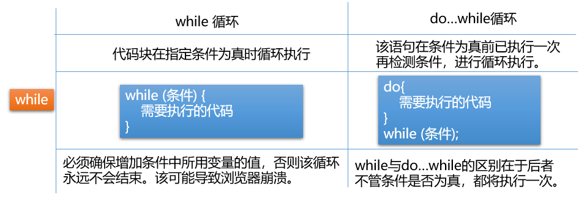
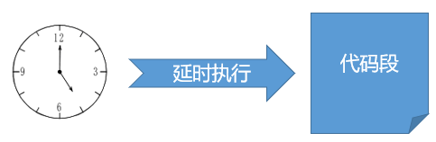

# day01
------
# 一、Web前端介绍

## 1.  什么是网页

网页是基于浏览器的应用程序，是数据展示的载体.

##  2.  网页的组成

1. 浏览器
   - 代替用户向服务器发请求
   - 接收并解析数据展示给用户
2. 服务器
   - 存储数据
   - 处理并响应请求
3. 协议
   - 规范数据在传输过程中的打包方式

## 3.  开发前的准备

1. 运行环境：浏览器，设置chrome为默认浏览器，作为网页文件的运行环境。
2. 调试工具：浏览器自带的调试工具，使用快捷键"F12"或右键"检查"打开。
3. 开发工具：不限，选用个人习惯的即可。（Sublime、VSCode、EditPlus、PyCharm等）

# 二、 HTML语法介绍

## 1.  HTML介绍

超文本标记语言（HyperText Markup Language）浏览器能够识别和解析的语言，通过标签的形式构建页面结构和填充内容

## 2. 标签

标签也称为标记或元素，用于在网页中标记内容

1. 语法：标签使用< >为标志，标签名不区分大小写，推荐小写表示

2. 分类：

   - 双标签：成对出现，包含开始标签和结束标签。例：

   ```html
   <html></html>
   ```

   - 单标签：只有开始标签，没有结束标签，可以手动添加“/”表示闭合。例：

   ```html
   <br>
   <br/>
   ```

3. 标签属性：

   - 标签属性书写在开始标签中，使用空格与标签名隔开，用于设置当前标签的显示内容或者修饰显示效果。由属性名和属性值组成，属性值使用双引号表示。例：

    ```HTML
    <meta charset="utf-8">
    ```

   - 同一个标签中可以添加若干组标签属性，使用空格间隔。例：

    ```html
    
    ```

## 3. 使用

1. 创建网页文件，使用.html或.htm作为文件后缀

2. 添加网页的基本结构

   ```html 
   <!doctype html>
   <html>
   	<head>
   		<title>网页标题</title>
   		<meta charset="utf-8">
   	</head>
   	<body>
            网页主体内容
   	</body>
   </html>
   ```

3. 标签嵌套
   在双标签中书写其他标签，称为标签嵌套

   - 嵌套结构中，外层元素称为父元素，内层元素称为子元素；
   - 多层嵌套结构中，所有外层元素统称为祖先元素，内层元素统称为后代元素
   - 平级结构互为兄弟元素

4. HTML语法规范

   - 标签名不区分大小写，建议使用小写
   - 注释语法：

   ```html
   <!-- 此处为注释 -->
   ```

# 三、常用标签介绍

## 1. 基本结构解析

 ```html
<!-- 文档类型声明，便于浏览器正确解析标签及渲染样式 -->
<!doctype html> 
<!-- HTML文档开始的标志 -->
<html> 
   <!-- 头部设置，可在head中设置网页标题，网页选项卡图标，引入外部的资源文件，设置网页相关信息等 -->
   <head>
       <!-- 设置网页标题，显示在网页选项卡上方 -->
       <title>网页标题</title>
       <!-- 设置网页字符编码 -->
       <meta charset="utf-8"> 
   </head>
   <!-- 网页主体部分，显示网页主要内容 -->
   <body> 
       网页主体内容
   </body>
</html><!-- 文档结束-->
 ```

## 2. body中常用标签

  - 文本标签

    - 标题标签：自带加粗效果，从h1到h6字体大小逐级递减

    ```html
     <h1>一级标题</h1>
     <h2>二级标题</h2>
     <h3>三级标题</h3>
     <h4>四级标题</h4>
     <h5>五级标题</h5>
     <h6>六级标题</h6>
    ```

    - 段落标签：

     ```html
     <p>段落文本</p>
     ```

    - 普通文本标签：

     ```html
     <span>行分区标签，用于对特殊文本特殊处理</span>
     <b>加粗标签</b>
     <strong>强调标签，效果同b标签</strong>
     <label>普通文本标签，常与表单控件结合实现文本与控件的绑定</label>
     <i>斜体标签</i>
     <u>下划线标签</u>
     ```

    - 格式标签：
      浏览器会忽略代码中的换行和空格，只显示为一个空格。想要实现页面中的换行，需要借助于换行标签。

     ```html
     <br>
     ```

    - 水平线标签，在页面中插入一条水平分割线

     ```html
     <hr>
     ```

    - 字符实体：
      某些情况下，浏览器会将一些特殊字符按照HTML的方式解析，影响显示结果。此时需要将这类字符转换为其他的形式书写
      例：

    ```
     使用 &lt; 在页面中呈现 "<"
     使用 &gt; 在页面中呈现 ">"
     使用 &nbsp; 在页面中呈现一个空格
     使用 &copy; 在页面中呈现版权符号"©"
     使用 &yen; 在页面中呈现人民币符号"￥"
    ```

  - 容器标签
    常用于页面结构划分，结合CSS实现网页布局

       ```html
       <div id="top">页面顶部区域</div>
       <div id="main">页面主体区域</div>
       <div id="bottom">页面底部区域</div>
       ```

  - 图片与超链接标签

    - 图片标签 ：用于在网页中插入一张图片。

      1. 属性 src 用于给出图片的URL，必填。
      2. 属性 width/height 用于设置图片尺寸，取像素值，默认按照图片的原始尺寸显示。
      3. 属性 title 用于设置图片标题，鼠标悬停在图片上时显示
      4. 属性 alt 用于设置图片加载失败后的提示文本

      语法：

    ```html
    
    ```

    - 超链接标签：用户可以点击超链接实现跳转至其他页面
      1. 属性 href 用于设置目标文件的URL，必填。
      2. 属性 target用于设置目标文件的打开方式，默认在当前窗口打开。可以设置新建窗口打开目标文本(取"_blank")

    ```html
    <a href="http://www.taobao.com" target="_self">淘宝</a>
    <a href="http://www.baidu.com" target="_blank">百度</a>
    ```

## 3. 常用结构标签

  - 列表标签 

    - 有序列表（ordered list）
      默认使用阿拉伯数字标识每条数据

     ```html
    <ol>
    	<li>list item 列表项</li> 
    	<li>list item 列表项</li>
    	<li>list item 列表项</li>
    </ol>
     ```

    - 无序列表（unordered list）
      默认使用实心圆点标识列表项

     ```html
     <ul>
      	<li>list item 列表项</li> 
      	<li>list item 列表项</li>
      	<li>list item 列表项</li>
      </ul>
     ```

    - 列表嵌套
      在已有列表中嵌套添加另一个列表，常见于下拉菜单

     ```html
    <ol>
    	<li>
    		西游记
    		<ul>
    			<li>孙悟空</li>
    			<li>孙悟空</li>
    			<li>孙悟空</li>
    		</ul>
    	</li>
    </ol>
     ```

  - 表格标签

    - 表格由行和单元格组成，常用于直接的数据展示或辅助排版,基本结构如下

    ```html
    <!-- 创建表格标签 -->
    <table>
    	 <!-- 创建行标签 -->
    	<tr>
    		<!-- 行中创建单元格以显示数据 -->
    		<td>姓名</td>
    		<td>年龄</td>
    		<td>班级</td>
    	</tr>
    	<tr>
    		<td>迪丽热巴</td>
    		<td>20</td>
    		<td>002</td>
    	</tr>
    </table>
    ```

    - 单元格合并：用于调整表格结构，分为跨行合并和跨列合并，合并之后需要删除被合并的单元格，保证表格结构完整

      | 单元格属性 | 作用           | 取值       |
      | ---------- | -------------- | ---------- |
      | colspan    | 跨列合并单元格 | 无单位数值 |
      | rowspan    | 跨行合并单元格 | 无单位数值 |

    - 行分组标签：可以将表格中的若干行划分为一组，表示表头，表尾及表格主体，默认在表格中创建的所有行都会被自动加入表格主体中

    ```html
    <table border="1px" width="300px" height="300px">
    	<thead></thead>
        <tfoot></tfoot>
        <tbody></tbody>
    </table>
    ```

  - 表单标签
    表单用于采集用户的信息并提交给服务器，由表单元素和表单控件组成。表单元素form负责提交数据给服务器，表单控件负责收集数据。

     - 表单使用<form></form>

    | 属性名  | 取值                                                         |
    | ------- | ------------------------------------------------------------ |
    | action  | 设置数据的提交地址                                           |
    | method  | 设置数据的提交方式，默认为get方式，可以设置为post            |
    | enctype | 设置数据的编码类型，涉及二进制数据提交（例如图片，文件，音视频等），必须设置数据的提交方式为post,编码类型为"multipart/form-data" |

    例如：

    ```html
    <form action="" method="" enctype="">
    	<!--此处为表单控件-->
    </form>
    ```

     - 表单控件使用（重点）
       表单控件用于采集用户信息，可设置以下标签属性

    | 属性名      | 取值                                   |
    | ----------- | -------------------------------------- |
    | type        | 设置控件类型                           |
    | name        | 设置控件名称，最终与值一并发送给服务器 |
    | value       | 设置控件的值                           |
    | placeholder | 设置输入框中的提示文本                 |
    | maxlength   | 设置输入框中可输入的最大字符数         |
    | checked     | 设置单选按钮或复选按钮的默认选中       |
    | selected    | 设置下拉菜单的默认选中                 |

表单控件用于采集用户信息，常用控件如下：

```html
  <input type="text">  文本框
  <input type="password">  密码框
  <input type="radio">  单选按钮
  <input type="checkbox">  复选框
  <input type="file">  文件上传
  <input type="button"> 普通按钮
  <input type="submit">  提交按钮
  <select></select>  下拉菜单
  <textarea></textarea> 文本域 
```


# day02

# CSS 基础使用

## 一、CSS介绍

 CSS全称为： Cascading Style Sheets ，意为层叠样式表 ，与HTML相辅相成，实现网页的排版布局与样式美化

## 二、CSS使用方式

### 1. 行内样式/内联样式

  借助于style标签属性，为当前的元素添加样式声明

  ```html
 <标签名 style="样式声明">
  ```

  CSS样式声明 : 由CSS属性和值组成
  例：

  ```html
 style="属性:值;属性:值;"
  ```

  常用CSS属性 :

  - 设置文本颜色 color:red;
  - 设置背景颜色 background-color:green;
  - 设置字体大小 font-size:32px;

### 2. 内嵌样式

  借助于style标签，在HTML文档中嵌入CSS样式代码，可以实现CSS样式与HTML标签之间的分离。同时需借助于CSS选择器到HTML 中匹配元素并应用样式
  示例:

  ```
  <style>
     	选择器{
     	 	属性:值;
      		属性:值;
     	}
  </style>
  ```

  选择器 : 通过标签名或者某些属性值到页面中选取相应的元素，为其应用样式
  示例：

  ```css     					
/*标签选择器 : 根据标签名匹配所有的该元素*/  
p{
    color:red;
  }
  ```

### 3. 外链样式表

  - 创建外部样式表文件 后缀使用.css
  - 在HTML文件中使用<link>标签引入外部样式表

  ```html
 <link rel="stylesheet" href="URL" type="text/css">
  ```

  - 样式表文件中借助选择器匹配元素应用样式

## 三、样式表特征

### 1. 层叠性

多组CSS样式共同作用于一个元素

### 2. 继承性

后代元素可以继承祖先元素中的某些样式
例 : 大部分的文本属性都可以被继承

### 3. 样式表的优先级

优先级用来解决样式冲突问题。同一个元素的同一个样式(例如文本色)，在不同地方多次进行设置，最终选用哪一种样式？此时哪一种样式表的优先级高选用哪一种。

  - 行内样式的优先级最高
  - 文档内嵌与外链样式表,优先级一致,看代码书写顺序,后来者居上
  - 浏览器默认样式和继承样式优先级较低

## 四、CSS 选择器

### 1. 作用

匹配文档中的某些元素为其应用样式

### 2. 分类 :

#### 1. 标签选择器

根据标签名匹配文档中所有该元素
语法 :

```css
标签名{
  属性:值;
}
```

#### 2. id选择器

根据元素的 id 属性值匹配文档中惟一的元素，id具有唯一性，不能重复使用
语法 :

```css
  #id属性值{
  
  }
```

注意 :
  id属性值自定义,可以由数字，字母，下划线，- 组成，不能以数字开头;
  尽量见名知意，多个单词组成时，可以使用连接符，下划线，小驼峰表示

#### 3. class选择器/类选择器

根据元素的class属性值匹配相应的元素,class属性值可以重复使用,实现样式的复用
语法 :

```css
.class属性值 {
 	
}
```

特殊用法 :

  1. 类选择器与其他选择器结合使用
     注意标签与类选择器结合时,标签在前,类选择器在后
         	例 : a.c1{ }
  2. class属性值可以写多个,共同应用类选择器的样式
     例 : 
         	.c1{  }
         	.c2{  }						

  	<p class="c1 c2"></p>

#### 4. 群组选择器

为一组元素统一设置样式
语法 :

```css
selector1,selector2,selector3{	         
}
```

#### 5. 后代选择器

匹配满足选择器的所有后代元素(包含直接子元素和间接子元素)
语法 :

```css
selector1 selector2{
}
```

匹配selector1中所有满足selector2的后代元素

#### 6. 子代选择器

匹配满足选择器的所有直接子元素
语法 :

```css
selector1>selector2{
}
```

#### 7. 伪类选择器

为元素的不同状态分别设置样式,必须与基础选择器结合使用
分类 :

```
:link 	 超链接访问前的状态
:visited 超链接访问后的状态
:hover	 鼠标滑过时的状态
:active  鼠标点按不抬起时的状态(激活)
:focus	 焦点状态(文本框被编辑时就称为获取焦点)
```

使用 :

```css
a:link{
}
a:visited{
}
.c1:hover{ }
```

注意 :

    1. 超链接如果需要为四种状态分别设置样式,必须按照以下顺序书写

  ```css
  :link
  :visited
  :hover
  :active
  ```

    2. 超链接常用设置 :

  ```css
  a{
  	/*统一设置超链接默认样式(不分状态)*/
  }
  a:hover{
  	/*鼠标滑过时改样式*/
  }
  ```

### 3. 选择器的优先级

使用选择器为元素设置样式,发生样式冲突时,主要看选择器的权重,权重越大,优先级越高

| 选择器       | 权重 |
| ------------ | ---- |
| 标签选择器   | 1    |
| (伪)类选择器 | 10   |
| id选择器     | 100  |
| 行内样式     | 1000 |

复杂选择器(后代,子代,伪类)最终的权重为各个选择器权重值之和
群组选择器权重以每个选择器单独的权重为准，不进行相加计算
例 :

```css
/*群组选择器之间互相独立，不影响优先级*/
body,h1,p{ /*标签选择器权重为 1 */
 color:red;
}
.c1 a{ /*当前组合选择器权重为 10+1  */
 color:green;
}
#d1>.c2{ /*当前组合选择器权重为 100+10 */
 color:blue;
}
```

## 五、标签分类及嵌套

### 1. 块元素

独占一行,不与元素共行;可以手动设置宽高,默认宽度与与父元素保持一致
例 : body div h1~h6 p ul ol li form, table(默认尺寸由内容决定)

### 2. 行内元素

可以与其他元素共行显示;不能手动设置宽高,尺寸由内容决定
例 : span label b strong i s u sub sup a

### 3. 行内块元素

可以与其他元素共行显示,又能手动调整宽高
例 : img input button (表单控件)

### 4. 嵌套原则

1. 块元素中可以嵌套任意类型的元素
   p元素除外,段落标签只能嵌套行内元素,不能嵌套块元素
2. 行内元素中最好只嵌套行内或行内块元素

## 六、尺寸单位

- px 像素单位
- % 百分比，参照父元素对应属性的值进行计算
- em 字体尺寸单位，参照父元素的字体大小计算，1em=16px
- rem字体尺寸单位,参照根元素的字体大小计算，1rem=16px

## 七、颜色单位

- 英文单词：red，green，blue
- rgb(r,g,b) 使用三原色表示，每种颜色取值0~255
- rgba(r,g,b,alpha) 三原色每种取值0~255，alpha取值0（透明）~1（不透明）
- 十六进制表示：以#为前缀，分为长十六进制和短十六进制。
  - 长十六进制：每两位为一组，代表一种三原色；每位的取值范围0~9，a~f
    例：red rgb(255,0,0) #ff0000
  - 短十六进制：由3位组成，每一位代表一种三原色，浏览器会自动对每一位进行重复扩充，仍然按照长十六进制解析
    例：#000  #fff   #f00

## 八、背景属性

### 1. 背景颜色

```css
background-color: red;
```

### 2. 背景图片相关

#### 1） 设置背景图片

```css
background-image : url("路径");
```

设置背景图片，指定图片路径，如果路径中出现中文或空格，需要加引号

#### 2） 设置背景图片的重复方式

默认背景图片从元素的左上角显示，如果图片尺寸与元素尺寸不匹配时，会出现以下情况：

1. 如果元素尺寸大于图片尺寸，会自动重复平铺，直至铺满整个元素
2. 如果元素尺寸小于图片尺寸，图片默认从元素左上角开始显示，超出部分不可见

```css
background-repeat:repeat/repeat-x/repeat-y/no-repeat
```

```text
取值 ：
	repeat  默认值，沿水平和垂直方向重复平铺
	repeat-x 沿X轴重复平铺
	repeat-y 沿Y轴重复平铺
	no-repeat 不重复平铺
```

#### 3） 设置背景图片的显示位置

默认显示在元素左上角

```css
background-position:x y;
```

取值方式 ：

```text
1. 像素值
	设置背景图片的在元素坐标系中的起点坐标
2. 方位值
	水平 ：left/center/right
	垂直 ：top/center/bottom
	注：如果只设置某一个方向的方位值，另外一个方向默认为center
3. 百分比
	类似于方位值，根据百分比计算背景图片的显示坐标。
	计算方式：
		横坐标 = (元素宽度 - 背景图片宽度）* x%
		纵坐标 = (元素高度 - 背景图片高度) * y %
	特殊值：
		0% 0%     左上角
		100% 100% 右下
		50% 50%   居中显示
```

精灵图技术 ：为了减少网络请求，可以将所有的小图标拼接在一张图片上，一次网络请求全部得到；借助于background-position进行背景图片位置的调整，实现显示不同的图标

#### 4）设置背景图片的尺寸

```css
background-size:width height;
```

取值方式 ：

```text
1. 像素值
	1. 500px 500px; 同时指定宽高
	2. 500px;  指定宽度，高度自适应
2. 百分比
	百分比参照元素的尺寸进行计算
	1. 50% 50%; 根据元素宽高,分别计算图片的宽高
	2. 50%; 根据元素宽度计算图片宽高,图片高度等比例缩放
```

### 3. 背景属性简写

```css
background:color url("") repeat position;
```

注意 ：

1. 如果需要同时设置以上属性值，遵照相应顺序书写
2. background-size 单独设置

## 九、文本属性

### 1. 字体相关

#### 1） 设置字体大小

```css
font-size:20px;
```

#### 2）设置字体粗细程度

```css
font-weight:normal;
```

取值 ：

```text
1. normal（默认值）等价于400
2. bold   (加粗) 等价于700
```

#### 3）设置斜体

```css
font-style:italic;
```

#### 4） 设置字体名称

```css
font-family:Arial,"黑体"; 
```

取值 :
    1. 可以指定多个字体名称作为备选字体,使用逗号隔开
    2. 如果字体名称为中文,或者名称中出现了空格,必须使用引号
例 :

```Css
font-family:Arial;
font-family:"黑体","Microsoft YaHei",Arial;
```

#### 5）字体属性简写

```css
font : style weight size family;
```

注意 :
    1. 如果四个属性值都必须设置,严格按照顺序书写
    2. size family 是必填项

### 2. 文本样式

#### 1）文本颜色

```css
color:red;
```

#### 2） 文本装饰线

```css
text-decoration:none;
```

取值 :
    underline		下划线
    overline		上划线
    line-through 	 删除线
    none			取消装饰线

#### 3）文本内容的水平对齐方式

```css
text-align:center;
```

取值 : 

```text
left(默认值)	左对齐
center		  居中对齐
right		  右对齐
justify		  两端对齐
```

#### 4）行高

```css
line-height:30px;
```

使用 :
    文本在当前行中永远垂直居中,可以借助行高调整文本在元素中的垂直显示位置
     	line-height = height 设置一行文本在元素中垂直居中
     	line-height > height 文本下移显示
     	line-height < height 文本靠上显示
     特殊 :
     	line-height可以采用无单位的数值,代表当前字体大小的倍数,以此计算行高

#### 5） font属性简写2

```css
font : size/line-height family;
```

# day03

# CSS 盒模型

## 1. 内容尺寸

- 一般情况下，为元素设置width/height，指定的是内容框的大小

- 内容溢出：内容超出元素的尺寸范围，称为溢出。默认情况下溢出部分仍然可见，可以使用overflow调整溢出部分的显示,取值如下：

  | 取值    | 作用                           |
  | ------- | ------------------------------ |
  | visible | 默认值，溢出部分可见           |
  | hidden  | 溢出部分隐藏                   |
  | scroll  | 强制在水平和垂直方向添加滚动条 |
  | auto    | 自动在溢出方向添加可用滚动条   |

## 2. 边框

### 1. 边框实现

语法：

```css
border:width style color;
```

边框样式为必填项，分为：

| 样式取值 | 含义     |
| -------- | -------- |
| solid    | 实线边框 |
| dotted   | 点线边框 |
| dashed   | 虚线边框 |
| double   | 双线边框 |

### 2. 单边框设置

分别设置某一方向的边框，取值：width style color;

| 属性          | 作用       |
| ------------- | ---------- |
| border-top    | 设置上边框 |
| border-bottom | 设置下边框 |
| border-left   | 设置左边框 |
| border-right  | 设置右边框 |


### 3. 网页三角标制作

1. 元素设置宽高为0
2. 统一设置四个方向透明边框
3. 调整某个方向边框可见色

### 4. 圆角边框

1. 属性：border-radius 指定圆角半径
2. 取值：像素值或百分比
3. 取值规律：

```
一个值 	表示统一设置上右下左
四个值 	表示分别设置上右下左
两个值 	表示分别设置上下 左右
三个值 	表示分别设置上右下，左右保持一致
```

## 3. 内边距

1. 属性：padding
2. 作用：调整元素内容框与边框之间的距离
3. 取值：

```
20px;					一个值表示统一设置上右下左
20px 30px;				两个值表示分别设置(上下) (左右)
20px 30px 40px;			三个值表示分别设置上右下，左右保持一致
20px 30px 40px 50px;	表示分别设置上右下左
```

4. 单方向内边距,只能取一个值：

```
padding-top
padding-right
padding-bottom
padding-left
```

## 4. 外边距

1. 属性：margin
2. 作用：调整元素与元素之间的距离
3. 特殊：
   1）margin:0; 取消默认外边距  
       		2）margin:0 auto;左右自动外边距，实现元素在父元素范围内水平居中  
       		3）margin:-10px;元素位置的微调  
4. 单方向外边距：只取一个值
   margin-top
       		margin-right
       		margin-bottom
       		margin-left
5. 外边距合并：  
   1）垂直方向  
       			1. 子元素的margin-top作用于父元素上  
         			解决：  
         				为父元素添加顶部边框；  
         				或为父元素设置padding-top:0.1px;  
         		2. 元素之间同时设置垂直方向的外边距，最终取较大的值  
   2）水平方向  
   	块元素对盒模型相关属性（width,height,padding,border,margin）完全支持;  
   	行内元素对盒模型相关属性不完全支持，不支持width/height,不支持上下边距  
   	行内元素水平方向上的外边距会叠加显示  
6. 带有默认边距的元素：  
   body,h1,h2,h3,h4,h5,h6,p,ul,ol{
     margin:0;
     padding:0;
     list-style:none;
   }

# 布局方式

## 1. 标准流/静态流

默认布局方式,按照代码书写顺序及标签类型从上到下,从左到右依次显示

## 2. 浮动布局

主要用于设置块元素的水平排列

#### 1）属性

	float

#### 2）取值 

可取left或right，设置元素向左浮动或向右浮动

```css
float:left/right;
```

#### 3）特点

+ 元素设置浮动会从原始位置脱流,向左或向右依次停靠在其他元素边缘,在文档中不再占位
+ 元素设置浮动,就具有块元素的特征,可以手动调整宽高
+ "文字环绕":浮动元素遮挡正常元素的位置,无法遮挡正常内容的显示,内容围绕在浮动元素周围显示

#### 4）常见问题 

子元素全部设置浮动,导致父元素高度为0,影响父元素背景色和背景图片展示,影响页面布局

#### 5）解决

+ 对于内容固定的元素,如果子元素都浮动,可以给父元素固定高度(例:导航栏)
+ 在父元素的末尾添加空的块元素。设置clear:both;清除浮动
+ 为父元素设置overflow:hidden;解决高度为0

## 3. 定位布局

结合偏移属性调整元素的显示位置

#### 1）属性

position

#### 2） 取值

可取relative（相对定位）/absolute（绝对定位）/fixed（固定定位）

```css
postion:relative/absolute/fixed/static
```

#### 3）偏移属性

设置定位的元素可以使用偏移属性调整距离参照物的位置

```text
top   	距参照物的顶部
right	距参照物的右侧
bottom	距参照物的底部
left	距参照物的左侧
```

#### 4）分类 

+ relative 相对定位

```text
元素设置相对定位,可参照元素在文档中的原始位置进行偏移,不会脱离文档流
```

+ absolute 绝对定位

```text
1. 绝对定位的元素参照离他最近的已经定位的祖先元素进行偏移,如果没有,则参照窗口进行偏移
2. 绝对定位的元素会脱流,在文档中不占位,可以手动设置宽高
```

使用绝对定位 :
	"父相子绝" : 父元素设置相对定位,子元素绝对定位，参照已定位的父元素偏移.

+ fixed	固定定位

```text
  1. 参照窗口进行定位,不跟随网页滚动而滚动
  2. 脱离文档流
```

#### 5）堆叠次序 

元素发生堆叠时可以使用 z-index 属性调整已定位元素的显示位置，值越大元素越靠上：

+ 属性 : z-index
+ 取值 : 无单位的数值,数值越大,越靠上
+ 堆叠：

  1. 定位元素与文档中正常元素发生堆叠，永远是已定位元素在上
  2. 同为已定位元素发生堆叠，按照 HTML 代码的书写顺序，后来者居上

# day04

# 一、 JavaScript 概述

 ## 1. 什么是JavaScript

#### 1) JS 介绍

简称JS，是一种浏览器解释型语言,嵌套在HTML文件中交给浏览器解释执行。主要用来实现网页的动态效果，用户交互及前后端的数据传输等。

#### 2) JS 组成

1. 核心语法 -ECMAScript 规范了JS的基本语法
2. 浏览器对象模型 -BOM
   Browser Object Model，提供了一系列操作浏览器的方法
3. 文档对象模型 -DOM
   Document Object Model ，提供了一系列操作的文档的方法

## 2. 使用方式

1. 元素绑定事件

   + 事件 ：指用户的行为（单击，双击等）或元素的状态（输入框的焦点状态等）
   + 事件处理：元素监听某种事件并在事件发生后自动执行事件处理函数。
   + 常用事件：onclick (单击事件) 
   + 语法 ：将事件名称以标签属性的方式绑定到元素上，自定义事件处理。

   ```html
   <!--实现点击按钮在控制台输出-->
   <button onclick="console.log('Hello World');">点击</button>
   ```

2. 文档内嵌。使用<script type="text/javascript"></script>标签书写 JS 代码

   + 语法 ：

   ```html
   <script type="text/javascript">
     alert("网页警告框");
   </script>
   ```

   + 注意 ：<script></script>标签可以书写在文档的任意位置，书写多次，一旦加载到script标签就会立即执行内部的JS代码，因此不同的位置会影响代码最终的执行效果

3. 外部链接

   + 创建外部的JS文件 XX.js，在HTML文档中使用<script src=""></script>引入

   ```html
   <script src="index.js"></script>
   ```

   + 注意 ：<script></script>既可以实现内嵌 JS 代码，也可以实现引入外部的 JS 文件，但是只能二选一。

# 二、基础语法

## 1. 语法规范

1. JS是由语句组成,语句由关键字,变量,常量,运算符,方法组成.分号可以作为语句结束的标志,也可以省略
2. JS严格区分大小写
3. 注释语法
   单行注释使用 //
   多行注释使用 /* */

## 2. JS的变量与常量

#### 1)  变量

1. 作用 : 用于存储程序运行过程中可动态修改的数据

2. 语法 : 使用关键var声明,自定义变量名

   ```javascript
   var a;		//变量声明
   a = 100;	//变量赋值
   var b = 200; //声明并赋值
   var m,n,k;	//同时声明多个变量
   var j = 10,c = 20; //同时声明并赋值多个变量
   ```

3. 命名规范 : 

   + 变量名,常量名,函数名,方法名自定义,可以由数字,字母,下划线,$组成,禁止以数字开头
   + 禁止与关键字冲突(var const function if else for while do break case switch return class)
   + 变量名严格区分大小写
   + 变量名尽量见名知意,多个单词组成采用小驼峰,例如："userName"

4. 使用注意 :

   + 变量如果省略var关键字,并且未赋值,直接访问会报错
   + 变量使用var关键字声明但未赋值,变量初始值为undefined
   + 变量省略var关键字声明,已被赋值,可正常使用.影响变量作用域

#### 2)  常量 

1. 作用 : 存储一经定义就无法修改的数据

2. 语法 : 必须声明的同时赋值

   ```javascript
   const PI = 3.14;
   ```

3. 注意 :

   + 常量一经定义,不能修改,强制修改会报错
   + 命名规范同变量,为了区分变量,常量名采用全大写字母

## 3. 数据类型

#### 1) 基本数据类型（简单数据类型）

1. number 数值类型

   + 整数

     1.   十进制表示

       ```javascript
        var a = 100;
       ```

         2. 八进制表示
            以0为前缀

       ```javascript
        var b = 021; //结果为十进制的 17
       ```

         3. 十六进制
            以0x为前缀

       ```javascript
        var c = 0x35;//结果为十进制的 53
       ```

          使用 : 整数可以采用不同进制表示,在控制台输出时一律会按照十进制输出

   + 小数

     1. 小数点表示

     ```javascript
      var m = 1.2345;
     ```

     2. 科学计数法
        例 : 1.5e3
         e表示10为底,e后面的数值表示10的次方数
        1.5e3 等价于 1.5 * 10(3)

2. string 字符串类型
   字符串 : 由一个或多个字符组成,使用""或''表示,每一位字符都有对应的Unicode编码

   ```javascript
   var s = "100";
   var s1 = "张三";
   ```


3. boolean 布尔类型
   只有真和假两个值，布尔值与number值可以互相转换。true 为 1，false 为 0

   ```javascript
   var isSave = true;
   var isChecked = false;
   ```

4. undefined  (程序返回的值)
   特殊值,变量声明未赋值时显示undefined

   ```javascript
   var a;
   console.log(a);//undefined
   ```

5. null 空类型  (主动使用的)
   解除对象引用时使用null,表示对象为空

#### 2) 引用数据类型

主要指对象，函数等

#### 3) 检测数据类型

typeof  变量或表达式
typeof (变量或表达式)


```javascript
var n = "asda";
console.log(typeof n);//string
console.log(typeof(n));//string
```

## 4. 数据类型转换

不同类型的数据参与运算时,需要转换类型

#### 1) 强制类型转换

1. 转换字符串类型
   方法 : toString()
   返回转换后的字符串

 ```javascript
 var a = 100;
 a = a.toString(); //"100"
 var b = true;
 b = b.toString(); //"true"
 ```

2. 转换number类型

   + Number(param)
     参数为要进行数据类型转换的变量或值，返回转换后的结果:
     	如果转换成功,返回number值
     	如果转换失败,返回NaN,(Not a Number)，只要数据中存在非number字符,一律转换失败，返回 NaN

   ```javascript
       Number("abc")
       typeof NaN
       Number(undefined)
       Number(null)
   ```

   + parseInt(param)
     参数为要解析的数据
         作用 : 从数据中解析整数值
         过程 :
             1. 如果参数为非字符串类型,会自动转成字符串
             2. 从左向右依次对每一位字符转number,转换失败则停止向后解析,返回结果
   + parseFloat(param)
     作用 : 提取number值，包含整数和小数部分

#### 2) 隐式类型转换（自动转换）

1. 当字符串与其他数据类型进行"+"运算时,表示字符串的拼接，不再是数学运算
   转换规则 ：将非字符串类型的数据转换成字符串之后进行拼接，最终结果为字符串

2. 其他情况下，一律将操作数转number进行数学运算

## 5. 运算符

#### 1) 赋值运算符 

	= 将右边的值赋给左边变量

#### 2) 算数运算符

	+ - * / %  加 减 乘 除 取余

#### 3) 复合运算符

	+= -= *= /= %=

#### 4) 自增或自减运算符

	++ -- 变量的自增和自减指的是在自身基础上进行 +1或-1 的操作

注意：

+ 自增或自减运算符在单独与变量结合时，放前和放后没有区别
+ 如果自增或自减运算符与其他运算符结合使用，要区分前缀和后缀,做前缀，那就先++/--,再进行赋值或其他运算，如果做后缀，就先结合其他运算符，再进行++ / --

#### 5) 关系运算符/比较运算符

	> <     
	>= <=
	==(相等) !=(不相等)
	===(全等) !==(不全等)

1. 关系运算符用来判断表达式之间的关系,结果永远是布尔值 true/false

2. 使用

   + 字符串与字符串之间的比较
     依次比较每位字符的Unicode码,只要某位字符比较出结果,就返回最终结果
   + 其他情况
     一律将操作数转换为number进行数值比较，如果某一操作数无法转换number，则变成NaN参与比较运算，结果永远是false

    null和其他数据类型做等值比较运算 不转换成数字
    null和undefined相等 但是 null和undefined不全等


3. 相等与全等
   + 相等 : 不考虑数据类型,只做值的比较(包含自动类型转换)
   + 全等 : 不会进行数据类型转换,要求数据类型一致并且值相等才判断全等

#### 6) 逻辑运算符 

1. && 逻辑与  条件1&&条件2  (and)
   表达式同时成立,最终结果才为true;全1则1
2. || 逻辑或  条件1||条件2   (or)
   表达式中只要有一个成立,最终结果即为true; 有1则1
3. ! 逻辑非    !条件  (not)
   对已有表达式的结果取反
   注意 : 除零值以外,所有值都为真

#### 7) 三目运算符

语法 :

```text
表达式1 ? 表达式2 : 表达式3;
```

过程 :
	判断表达式1是否成立,返回布尔值
	如果表达式1成立,执行表达式2;
	如果表达式1不成立,执行表达式3;

a>b?console.log('a比b大'):console.log('b比a大')
 1                2                3

# day05

# 一、流程控制

## 1. 作用

控制代码的执行顺序

## 2. 分类

#### 1）顺序结构

从上到下依次执行代码语句

#### 2）分支/选择结构

##### 1. if语句

+ 简单if结构

  ``` text
  if(条件表达式){
  	表达式成立时执行的代码段
  }
  ```

  注意 : 除零值以外，其他值都为真，以下条件为假值false

  ```javascript
  if(0){}
  if(0.0){}
  if(""){} //空字符串
  if(undefined){}
  if(NaN){}
  if(null){}
  ```

  特殊写法 :
  	{ }可以省略,一旦省略，if语句只控制其后的第一行代码

+ if - else结构

  ```text
  if(条件表达式){
  	//条件成立时执行
  }else{
  	//条件不成立时选择执行
  }
  ```

+ 多重分支结构

  ```javascript
    if(条件1){
    	//条件1成立时执行
    }else if(条件2){
    	//条件2成立时执行
    }else if(条件3){
    	//条件3成立时执行
    }...else{
    	//条件不成立时执行
    }
  ```


##### 2. switch语句

+ 语法 :

```javascript
switch(value){
	 case 值1 :
	 //value与值1匹配全等时,执行的代码段
	 break; //结束匹配
	 case 值2 :
	 //value与值2匹配全等时,执行的代码段
	 break;
	 case 值3 :
     //value与值3匹配全等时,执行的代码段
	 break;
	 default:
 	 //所有case匹配失败后默认执行的语句
 	 break;
}
```

+ 使用 :

```javascript
1. switch语句用于值的匹配，case用于列出所有可能的值；只有switch()表达式的值与case的值匹配全等时，才会执行case对应的代码段
2. break用于结束匹配，不再向后执行；可以省略，break一旦省略，会从当前匹配到的case开始，向后执行所有的代码语句，直至结束或碰到break跳出
3. default用来表示所有case都匹配失败的情况，一般写在末尾，做默认操作
4. 多个case共用代码段
  		case 值1:
  		case 值2:
  		case 值3:
  		//以上任意一个值匹配全等都会执行的代码段
```


#### 3）循环结构

+ 作用
  根据条件，重复执行某段代码
+ 分类

1. while循环

```text
定义循环变量;
   while(循环条件){
   条件满足时执行的代码段
   更新循环变量;
}
```

2. do-while循环

```text
do{
	循环体;
	更新循环变量
}while(循环条件);
```



与 while 循环的区别 :

+ while 循环先判断循环条件，条件成立才执行循环体
+ do-while 循环不管条件是否成立，先执行一次循环体

3. for 循环

```text
for(定义循环变量;循环条件;更新循环变量){
	循环体;
}
```


循环控制 :

1. break 强制结束循环
2. continue 结束当次循环，开始下一次循环
   循环嵌套 :
   在循环中嵌套添加其他循环


# 二、函数


## 1. 作用 

  封装一段待执行的代码

## 2. 语法 

```javascript
  //函数声明
  function 函数名(参数列表){
  	函数体
  	return 返回值;
  }
  //函数调用
  函数名(参数列表);
```


## 3. 使用 

  	函数名自定义，见名知意，命名规范参照变量的命名规范。普通函数以小写字母开头，用于区分构造函数(构造函数使用大写字母开头，定义类)


## 4. 匿名函数

匿名函数：省略函数名的函数。语法为：

- 匿名函数自执行

```javascript
 (function (形参){
  
 })(实参);
```

- 定义变量接收匿名函数

```4/javascript
 var fn = function (){};
 fn(); //函数调用1
```


## 5. 作用域

JavaScript 中作用域分为全局作用域和函数作用域，以函数的{ }作为划分作用域的依据

1. 全局变量和全局函数
   - 只要在函数外部使用 var 关键字定义的变量，或函数都是全局变量和全局函数，在任何地方都可以访问
   - 所有省略 var 关键字定义的变量，一律是全局变量
2. 局部变量/局部函数
   - 在函数内部使用 var 关键字定义的变量为局部变量，函数内部定义的函数也为局部函数，只能在当前作用域中使用，外界无法访问
3. 作用域链
   局部作用域中访问变量或函数，首先从当前作用域中查找，当前作用域中没有的话，向上级作用域中查找，直至全局作用域


## 6. 获取多个DOM元素和控制属性

1. 根据标签名获取元素节点列表

```javascript
var elems = document.getElementsByTagName("");
/*
参数 : 标签名
返回值 : 节点列表,需要从节点列表中获取具体的元素节点对象,添加相应下标。
*/
```

2. 根据 class 属性值获取元素节点列表

```JavaScript
var elems = document.getElementsByClassName("");
/*
参数 : 类名(class属性值)
返回值 : 节点列表
*/
```

3. 元素节点对象提供了以下属性来操作元素内容

```text
innerHTML : 读取或设置元素文本内容,可识别标签语法
innerText : 设置元素文本内容,不能识别标签语法
value : 读取或设置表单控件的值
```

4. 获取 DOM 树中的属性值


5. 设置 DOM 树中的属性值：


```javascript
elem.getAttribute("attrname");//根据指定的属性名返回对应属性值
elem.setAttribute("attrname","value");//为元素添加属性,参数为属性名和属性值
elem.removeAttribute("attrname");//移除指定属性
```

# day06

# 一、 内置对象

  ## 1） 对象

  对象是由属性和方法组成的,使用点语法访问

  ## 2） Array 数组

  #### 1. 创建 

  #### 2. 特点 

+ 数组用于存储若干数据,自动为每位数据分配下标,从0开始
+ 数组中的元素不限数据类型,长度可以动态调整
+ 动态操作数组元素 ：根据元素下标读取或修改数组元素，arr[index]

#### 3. 属性和方法

1. 属性 : length 表示数组长度,可读可写

2. 方法 :

   + push(data)
     在数组的末尾添加一个或多个元素,多个元素之间使用逗号隔开
     返回添加之后的数组长度

   + pop()
     移除末尾元素
     返回被移除的元素

   + unshift(data)
     在数组的头部添加一个或多个元素
     返回添加之后的数组长度

   + shift()
     移除数组的第一个元素
     返回被移除的元素

   + splice(index,num)

     从数组中添加/删除项目

     返回被删除的项目

   + toString()
     将数组转换成字符串类型
     返回字符串结果

   + join(param)
     将数组转换成字符串,可以指定元素之间的连接符,如果参数省略,默认按照逗号连接
     返回字符串

   + reverse()
     反转数组,倒序重排
     返回重排的数组,注意该方法直接修改原数组的结构

   + sort()
     对数组中元素排序,默认按照Unicode编码升序排列
     返回重排后的数组,直接修改原有数组
     参数 : 可选,自定义排序算法
     例：

       ```javascript
       //自定义升序
       function sortASC(a,b){
         return a-b;
       }
       ```

      作用：作为参数传递到sort()中,会自动传入两个元素进行比较,如果a-b>0,交换元素的值,自定义升序排列

       ```javascript
       //自定义降序
       function sortDESC(a,b){
       	return b-a;
       }
       //如果返回值>0,交换元素的值,b-a表示降序排列
       ```

#### 4. 二维数组 

数组中的每个元素又是数组

```javascript
 var arr1 = [1,2,3];
 var arr2 = [[1,2],[3,4],[5,6,7]];
 //操作数组元素
 var r1 = arr2[0] //内层数组
 var num = r1[0]; //值 1
 //简写
 var num2 = arr2[1][0];
```

## 3）String 对象

#### 1. 创建 

```javascript
    var str = "100";
    var str2 = new String("hello");
```

#### 2. 特点 

字符串采用数组结构存储每位字符,自动为字符分配下标,从0开始

#### 3. 属性 

length ：获取字符串长度

#### 4. 方法 

+ 转换字母大小写
  toUpperCase() 转大写字母
  toLowerCase() 转小写字母
  返回转换后的字符串,不影响原始字符串

+ 获取字符或字符编码
  charAt(index)	   获取指定下标的字符
  charCodeAt(index)  获取指定下标的字符编码
  参数为指定的下标,可以省略,默认为0

+ 获取指定字符的下标

  + indexOf(str,fromIndex)
    作用 : 获取指定字符的下标,从前向后查询,找到即返回
    参数 :
    str 表示要查找的字符串,必填
    fromIndex 表示起始下标,默认为0
    返回 :
    返回指定字符的下标,查找失败返回-1

+ 截取字符串
  substring(startIndex,endIndex)
  作用 : 根据指定的下标范围截取字符串,startIndex ~ endIndex-1
  参数 :
   startIndex	表示起始下标
   endIndex	表示结束下标,可以省略,省略表示截止末尾

+ substr(startIndex,len)

  作用：根据下标截取指定的字符串

+ 分割字符串
  split(param)
  作用 : 将字符串按照指定的字符进行分割,以数组形式返回分割结果
  参数 : 指定分隔符,必须是字符串中存在的字符,如果字符串中不存在,分割失败,仍然返回数组

+ 模式匹配

+ 正则表达式对象 RegExp

  RegExp : Regualr Expression

  1. 语法 ：
     var reg1 = /微软/ig;
     var reg2 = new RegExp('匹配模式','修饰符');
     正则表达式对象可以接收一个变量。

  2. 属性 ：

     lastIndex : 可读可写，表示下一次匹配的起始索引
     注意 ：

     1. 默认情况下，正则表达式对象不能重复调用方法，
        如果重复调用，结果会出错：
        由于 lastIndex 保存再一次匹配的起始下标，
        重复调用时，不能保证每次都从下标0开始
        验证，可以手动调整 lastIndex 为 0。
     2. 只有正则对象设置全局匹配 g ，该属性才起作用。

  3. 方法 ：

     test(str) :验证字符串中是否存在满足正则匹配模式的内容，存在则返回true，

     不存在返回false参数为要验证的字符串。

+ 作用 : 借助正则表达式实现字符串中固定格式内容的查找和替换
  正则表达式 :
   var reg1 = /字符模式/修饰符;
   修饰符 : 
    i :  ignorecase 忽略大小写
    g : global 全局范围
  字符串方法 :

  + match(regExp/subStr)
    作用 : 查找字符串中满足正则格式或满足指定字符串的内容
    返回 : 数组,存放查找结果
  + replace(regExp/subStr,newStr)
    作用 : 根据正则表达式或字符串查找相关内容并进行替换
    返回 : 替换后的字符串,不影响原始字符串。

## 4)  Math 对象

#### 1. 定义

Math对象主要提供一些列数学运算的方法

#### 2. 属性

1. 圆周率 :  Math.PI
2. 自然对数 : Math.E

#### 3. 方法

1. Math.random();   生成0-1之间的随机数
2. Math.ceil(x);	     对x向上取整,忽略小数位,整数位+1
3. Math.floor(x);      对x向下取整,舍弃小数位,保留整数位
4. Math.round(x);    对x四舍五入取整数

## 5）日期对象

#### 1. 创建日期对象

      1. var date2 = new Date("2011/11/11");
      2. var date3 = new Date("2011/11/11 11:11:11");

#### 2. 日期对象方法

1. 读取或设置当前时间的毫秒数：getTime()
2. 获取时间分量
   - getFullYear()
   - getMonth()
   - getDate()

# day07

# 一、BOM 对象

## 1. BOM 介绍 

​		BOM全称为“Browser Object Model”，浏览器对象模型。提供一系列操作浏览器的属性和方法。核心对象为window对象，不需要手动创建，跟随网页运行自动产生，直接使用，在使用时可以省略书写。

## 2. 对象方法

1. ##### 网页弹框

   ```javascript
   alert()		//警告框
   confirm()	//确认框
   ```

2. ##### 定时器方法


**周期性定时器**
	作用：每隔一段时间就执行一次代码

```javascript
//开启定时器:
var timerID = setInterval(function,interval);
/*
参数 :
 function : 需要执行的代码,可以传入函数名;或匿名函数
 interval : 时间间隔,默认以毫秒为单位 1s = 1000ms
返回值 : 返回定时器的ID,用于关闭定时器
*/
```

   关闭定时器 :

```javascript
//关闭指定id对应的定时器
clearInterval(timerID);
```



**一次性定时器**
	作用：等待多久之后执行一次代码

```javascript
//开启超时调用:
var timerId = setTimeout(function,timeout);
//关闭超时调用:
clearTimeout(timerId);
```

## 3. 对象属性

window的大部分属性又是对象类型

1. ##### history

   作用：保存当前窗口所访问过的URL
   属性 :  length 表示当前窗口访问过的URL数量
   方法 :

   ```javascript
   back() 对应浏览器窗口的后退按钮，访问前一个记录
   forward() 对应前进按钮，访问记录中的下一个URL
   ```

2. ##### location

   作用：保存当前窗口的地址栏信息(URL) 
   属性 :  href 设置或读取当前窗口的地址栏信息
   方法 :

   ```text
   reload(param) 重载页面(刷新)
   参数为布尔值，默认为 false，表示从缓存中加载，设置为true,强制从服务器根目录加载
   ```

# 二、DOM节点操作

DOM全称为 “Document Object Model”，文档对象模型，提供操作HTML文档的方法。（注：每个html文件在浏览器中都视为一篇文档,操作文档实际就是操作页面元素。）

## 1. 节点对象

JavaScript 会对 html 文档中的元素、属性、文本甚至注释进行封装，称为节点对象，提供相关的属性和方法。

## 2. 访问节点

- 元素节点   ( 操作标签）
- 属性节点（操作标签属性）
- 文本节点（操作标签的文本内容）

标签属性都是元素节点对象的属性,可以使用点语法访问，例如：

```javascript
h1.id = "d1"; 		 //set 方法
console.log(h1.id);  //get 方法
h1.id = null;		//remove 方法
```

注意 :

- 属性值以字符串表示
- class属性需要更名为 className，避免与关键字冲突，例如：
  h1.className = "c1 c2 c3"；

## 3. 操作元素样式

1. 为元素添加 id、class属性，对应选择器样式
2. 操作元素的行内样式，访问元素节点的style属性，获取样式对象；样式对象中包含CSS属性，使用点语法操作。

```javascript
p.style.color = "white";
p.style.width = "300px";
p.style.fontSize = "20px";
```

注意 :

- 属性值以字符串形式给出，单位不能省略
- 如果css属性名包含连接符，使用JS访问时，一律去掉连接符,改为驼峰， font-size -> fontSize

# day08

# jQuery简介

## 1. 介绍 

jQuery是JavaScript的工具库，对原生JavaScript中的DOM操作、事件处理、包括数据处理和Ajax技术等进行封装,提供更完善，更便捷的方法。

## 2. 使用 

#### 1）引入

先引入jquery文件，才能使用jquery语法

1. CDN 有网（备用）
2. 本地文件（常用）

#### 2）工厂函数 - $()

"$()"函数用于获取元素节点，创建元素节点或将原生JavaScript对象转换为jquery对象,返回 jQuery 对象。jQuery 对象实际是一个类数组对象，包含了一系列 jQuery 操作的方法。
例如 :

```javascript
 //$()获取元素节点,需传入字符串的选择器
 $("h1")
 $("#d1")
 $(".c1")
 $("body,h1,p")
 //选择器的特点，与样式选择器一致
```

#### 3）原生JavaScript对象与jQuery对象

原生JavaScript对象与jQuery对象的属性和方法不能混用。可以根据需要，互相转换 :

1. 原生JavaScript转换jQuery对象
   $(原生对象)，返回 jQuery 对象
2. jQuery对象转换原生JavaScript对象
   + 方法一 : 根据下标取元素,取出即为原生对象
     var div = $("div")[0];
   + 方法二 : 使用jQuery的get(index)取原生对象
     var div2 = $("div").get(0);

#### 4）jQuery获取元素

jQuery通过选择器获取元素，$("选择器")
选择器分类 :

1. 基础选择器

```text
标签选择器：$("div")
ID 选择器：$("#d1")
类选择器：$(".c1")
群组选择器：$("body,p,h1")
```

2. 层级选择器

```text
后代选择器： $("div .c1")
子代选择器： $("div>span")
相邻兄弟选择器： $("h1+p")  匹配选择器1后的第一个兄弟元素,同时要求兄弟元素满足选择器2
通用兄弟选择器： $("h1~h2") 匹配选择器1后所有满足选择器2的兄弟元素
```

3. 过滤选择器，需要结合其他选择器使用。

```text
:first
  匹配第一个元素 例:$("p:first")
:last
  匹配最后一个元素 例:$("p:last")
:odd
  匹配奇数下标对应的元素
:even
  匹配偶数下标对应的元素
:eq(index)
  匹配指定下标的元素
:lt(index)
  匹配下标小于index的元素
:gt(index)
  匹配下标大于index的元素
:not(选择器)
  否定筛选,除()中选择器外,其他元素
```

#### 5）操作元素内容

```javascript
html() //设置或读取标签内容,等价于原生innerHTML,可识别标签语法
text() //设置或读取标签内容,等价于innerText,不能识别标签
val()  //设置或读取表单元素的值,等价于原生value属性
```

#### 6）操作标签属性

1. attr("attrName","value")
   设置或读取标签属性
2. prop("attrName","value")
   设置或读取标签属性
   注意 :在设置或读取元素属性时,attr()和prop()基本没有区别;但是在读取或设置表单元素(按钮)的选中状态时,必须用prop()方法,attr()不会监听按钮选中状态的改变,只看标签属性checked是否书写
3. removeAttr("attrName")
   移除指定属性

#### 7）操作标签样式

1. 为元素添加id/class属性,对应选择器样式
2. 针对类选择器,提供操作class属性值的方法

```javascript
addClass("className")	//添加指定的类名
removeClass("className")//移除指定的类型,如果参数省略,表示清空class属性值
toggleClass("className")//结合用户行为,实现动态切换类名.如果当前元素存在指定类名,则移除;不存在则添加
```

3. 操作行内样式

```javascript
css("属性名","属性值")  //设置行内样式
css(JavaScriptON对象)			 //设置一组CSS样式
/*
JavaScriptON对象:常用数据传输格式
语法 :
   {
    "width":"200px",
    "height":"200px",
    "color":"red"
   }
 */
```

#### 8）元素的创建,添加,删除

1. 创建：使用$("标签语法")，返回创建好的元素

```javascript
var div = $("<div></div>");	//创建元素
div.html("动态创建").attr("id","d1").css("color","red"); //链式调用，设置内容和属性
var h1 = $("<h1 id='d1'>一级标题</h1>");	//创建的同时设置内容，属性和样式
```

2. 作为子元素添加

```javascript
$obj.append(newObj);	//在$obj的末尾添加子元素newObj
$obj.prepend(newObj);	//作为第一个子元素添加至$obj中
```

3. 作为兄弟元素添加

```javascript
$obj.after(newObj);		//在$obj的后面添加兄弟元素
$obj.before(newObj);	//在$obj的前面添加兄弟元素
```

4. 移除元素 

```javascript
$obj.remove();	//移除$obj
```

#### 9）动画效果

1. 显示和隐藏

   ```javascript
    show(speed,callback)/hide(speed,callback)
   ```

   - speed	  可选。规定元素从隐藏到完全可见的速度。默认为 "0"。
   - callback   可选。show 函数执行完之后，要执行的函数

2. 通过使用滑动下拉和上推效果，显示隐藏的被选元素（ **只针对块元素** ）

   ```javascript
    slideDown(speed,callback)/slideUp(speed,callback)
   ```

3. 通过使用淡隐淡现方式显示效果，显示隐藏的被选元素

   ```javascript
    fadeOut(speed,callback)/fadeIn(speed,callback)
   ```

4. 动画函数，可以实现自定义动画 animate 函数

   ```javascript
   animate(styles,speed,callback)
   ```

   - styles    必需。规定产生动画效果的 CSS 样式和值
   - speed   可选。规定动画的速度。默认是 "normal"
   - callback   可选。show 函数执行完之后，要执行的函数

#### 10）数据与对象遍历

1. $(selector).each() 方法规定为每个匹配元素规定运行的函数

   ```javascript
   $(selector).each(function(index,element){})
   ```

   必需。为每个匹配元素规定运行的函数。

   - *index* - 选择器的 index 位置
   - element - 当前的元素

2. $.each()函数是框架提供的一个工具类函数，通过它，你可以遍历对象、数组的属性值并进行处理

   ```javascript
   $.each(Object, function(index, data){});
   ```

   必需。为每个匹配元素规定运行的函数。

   - *index* - 选择器的 index 位置
   - data- 当前的数据

#### 11）jQuery事件处理

1. 文档加载完毕
   原生JavaScript 方法：window.onload
   jQuery:

```javascript
//语法一 
$(document).ready(function (){
  //文档加载完毕后执行
})
//语法二 
$().ready(function (){
  //文档加载完毕后执行
})
//语法三 
$(function(){
  //文档加载完毕后执行
})
```

区别：
原生onload事件不能重复书写，会产生覆盖问题；jquery中对事件做了优化,可以重复书写ready方法,依次执行

2. 事件绑定方式
   事件名称省略 on 前缀

```javascript
  //on("事件名称"，function)
  $("div").on("click",function(){});//新版本使用的多些
  //bind("事件名称",function)
  $("div").bind("click",function(){});//1.6-1.8间的版本
  //事件名作为方法名
  $("div").click(function(){});  
```

3. this表示事件的触发对象，在jquery中可以使用，注意转换类型。this为原生对象只能使用原生的属性和方法，可以使用$(this)转换为jquery对象，使用jquery方法。

## 3.实战

### 	1. 页面效果


###     2. 代码分析

####             1. 页面元素

​                   

#### 		    2. 初始代码

​                   

####             3. 绑定省份

​                    

####              4. 绑定城市

​                    
