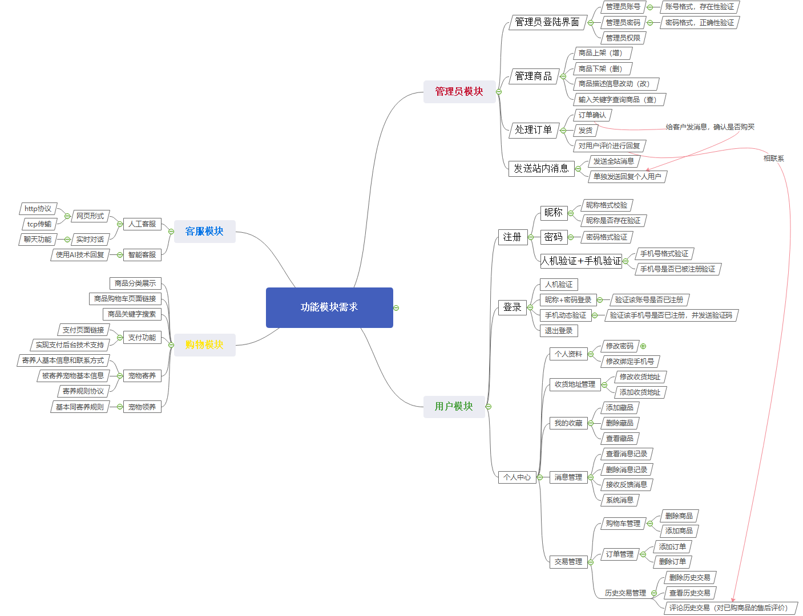

# 网上宠物商城数据库设计

## 数据表设计

### user表（用户表）

|     字段      |    类型     |    标识    |   描述   |
| :-----------: | :---------: | :--------: | :------: |
|      u_id      |     int     |    主键    | 用户编号 |
|   user_name   | varchar(50) | 唯一，非空 | 用户昵称 |
|   password    | varchar(50) |    非空    | 登录密码 |
| phone_number  |  varchar(50)  |    唯一    |  手机号  |
| register_time | varchar(50) |  系统时间  | 注册时间 |
|  email   |       varchar(50)       |      |   邮箱   |
| realname |       varchar(50)       |      | 真实姓名 |
|  idcard  |       varchar(50)       |      |  身份证  |
|   sex    | enum('男','女'，‘其他’) |      |   性别   |
| birthday | date | | 生日 |

### admin(管理员表)

|  字段  |    类型     | 标识 |    描述    |
| :----: | :---------: | :--: | :--------: |
|  a_id  |     int     | 主键 | 管理员编号 |
| a_name | varchar(50) |      | 管理员昵称 |
| a_pwd  | varchar(50) |      | 管理员密码 |

### shipping_address表（收货地址表）

|         字段          |     类型     | 标识 |      描述      |
| :-------------------: | :----------: | :--: | :------------: |
|         sa_id         |     int      | 主键 |  收货地址编号  |
|         u_id          |     int      | 外键 |    用户编号    |
|     receiver_name     | varchar(50)  | 非空 |   收货人姓名   |
|       province        | varchar(50)  |      |      省份      |
|         city          | varchar(50)  |      |      城市      |
|        address        | varchar(100) |      |  详细街道地址  |
|       postcode        | varchar(50)  |      |      邮编      |
| receiver_phone_number | varchar(50)  |      |  收货人手机号  |
|      is_default       |     bit      |      | 是否为默认地址 |

### pet_category(宠物大类表)

|     字段      |    类型     | 标识 |     描述     |
| :-----------: | :---------: | :--: | :----------: |
|     pc_id     |     int     | 主键 | 宠物大类编号 |
| category_name | varchar(50) |      | 宠物大类名称 |

### pet_variety(宠物品种表)

|        字段        |    类型     | 标识 |       描述       |
| :----------------: | :---------: | :--: | :--------------: |
|       pv_id        |     int     | 主键 |   宠物品种编号   |
|       pc_id        |     int     | 外键 |   宠物大类编号   |
|      pv_name       | varchar(50) |      |     品种名称     |
| foster_daily price |   double    |      | 寄养价格（每天） |

### pet(宠物表)

|    字段    |     类型     | 标识 |       描述       |
| :--------: | :----------: | :--: | :--------------: |
|    p_id    |     int      | 主键 |     宠物编号     |
|   pv_id    |     int      | 外键 | 所属宠物品种编号 |
|   p_name   | varchar(50)  |      |      宠物名      |
| p_describe | varchar(200) |      |     宠物描述     |
|  p_price   |    double    |      |     宠物价格     |
|  p_image   | varchar(50)  |      |     宠物照片     |

### pet_product(宠物相关商品表)

|         字段         |     类型     | 标识 |     描述     |
| :------------------: | :----------: | :--: | :----------: |
|        pp_id         |     int      | 主键 | 宠物商品编号 |
|        pc_id         |     int      | 外键 | 所属宠物大类 |
|       pp_name        | varchar(50)  |      |   商品名称   |
|     pp_descripe      | varchar(200) |      |   商品描述   |
|       pp_price       |    double    |      |   商品价格   |
|     pp_quantity      |     int      |      |   库存数量   |
|       pp_image       | varchar(50)  |      |   商品图片   |
| is_featured_products |     bit      |      | 是否特色产品 |

### user_order(用户订单表)

|         字段          |     类型     | 标识 |       描述        |
| :-------------------: | :----------: | :--: | :---------------: |
|         id         |     int      | 主键 |     订单id      |
| uo_id | varchar(50) | 唯一 | 订单编号(以时间为内容) |
|         u_id          |     int      | 外键 |     用户编号      |
|       uo_price        |    double    |      |     订单价格      |
|      order_time       |   datetime   |      |     下单时间      |
|     order_status      |     enum('交易取消'，’等待付款‘，’未发货‘，’已发货‘，’已完成‘)     |      |     订单状态      |
| order_completion_time |   datetime   |      |   订单完成时间    |
|    pm_id    | int | 外键 |   付款方式编号    |
|   shipping_address    | varchar(200) |      | 收货地址/上门地址 |
|     user_reviews      | varchar(300) |      |     用户评价      |
|      store_reply      | varchar(300) |      |     商家回评      |

说明：订单表包括商品订单和宠物领养和寄养订单

### order_product(订单商品表)

|       字段        | 类型 | 标识 |     描述     |
| :---------------: | :--: | :--: | :----------: |
|       op_id       | int  | 主键 | 订单商品编号 |
|       uo_id       | int  | 外键 |   订单编号   |
|       pp_id       | int  | 外键 | 宠物商品编号 |
| purchase_quantity | int  |      |   购买数量   |

### shopping cart(购物车表)

|    字段     |  类型  | 标识 |    描述    |
| :---------: | :----: | :--: | :--------: |
|    sc_id    |  int   | 主键 | 购物车编号 |
|    u_id     |  int   | 外键 |   用户id   |
| total_price | double |      |    合计    |

### cart_product(购物车商品表)

|   字段   | 类型 | 标识 |     描述     |
| :------: | :--: | :--: | :----------: |
|  cp_id   | int  | 主键 |     编号     |
|  sc_id   | int  | 外键 |  购物车编号  |
|  pp_id   | int  | 外键 | 宠物商品编号 |
| quantity | int  |      |     数量     |

### pet_foster_order(宠物寄养订单表)

|     字段     | 类型 | 标识 |        描述        |
| :----------: | :--: | :--: | :----------------: |
|    pfo_id    | int  | 主键 |  宠物寄养订单编号  |
|    uo_id     | int  | 外键 |      订单编号      |
|    pv_id     | int  | 外键 | 要寄养的宠物的品种 |
| pet_quantity | int  |      | 该品种宠物寄养数量 |
|  start_date  | date |      |      开始日期      |
|   end_date   | date |      |      结束日期      |

### pet_adoption_order(宠物领养订单)

|  字段  | 类型 | 标识 |       描述       |
| :----: | :--: | :--: | :--------------: |
| pao_id | int  | 主键 | 宠物领养订单编号 |
| uo_id  | int  | 外键 |     订单编号     |
|  p_id  | int  | 外键 |     宠物编号     |

### payment_method(支付方式表)

|  字段   |    类型     | 标识 |     描述     |
| :-----: | :---------: | :--: | :----------: |
|  pm_id  |     int     | 主键 | 支付方式编号 |
| pm_name | varchar(50) |      | 支付方式名称 |

### user_feedback(用户反馈表)

|       字段       |     类型     | 标识 |     描述     |
| :--------------: | :----------: | :--: | :----------: |
|      uf_id       |     int      | 主键 | 用户反馈编号 |
|       u_id       |     int      | 外键 |   用户编号   |
| feedback_content | varchar(300) |      |   反馈内容   |
|   feedbck_time   |   datetime   |      |   反馈时间   |
|   store_reply    | varchar(300) |      |   店家回复   |
|    reply_time    |   datetime   |      |   回复时间   |

### user_favorites(用户收藏表)

| 字段  | 类型 | 标识 |     描述     |
| :---: | :--: | :--: | :----------: |
| uf_id | int  | 主键 | 用户收藏编号 |
| u_id  | int  | 外键 |   用户编号   |

### favorites(收藏表)

| 字段  | 类型 | 标识 |     描述     |
| :---: | :--: | :--: | :----------: |
| f_id  | int  | 主键 |   收藏编号   |
| uf_id | int  | 外键 | 用户收藏编号 |
| p_id  | int  | 外键 |   宠物编号   |
| pp_id | int  | 外键 | 宠物商品编号 |

### station_news(全站消息表)

|    字段    |     类型     | 标识 |     描述     |
| :--------: | :----------: | :--: | :----------: |
|   sn_id    |     int      | 主键 | 全站消息编号 |
| sn_content | varchar(300) |      |   消息内容   |
|  sn_time   |   datetime   |      |   发布时间   |

### message(消息表)

|   字段    |     类型     | 标识 |           描述           |
| :-------: | :----------: | :--: | :----------------------: |
|   m_id    |     int      | 主键 |         消息编号         |
|   u_id    |     int      | 外键 | 用户编号（消息接收对象） |
| m_content | varchar(300) |      |         消息内容         |
|  m_time   |   datetime   |      |         发送时间         |
| m_status  |     bit      |      |        已读/未读         |

### coupon_code(优惠码表)

|     字段     |    类型     | 标识 |    描述    |
| :----------: | :---------: | :--: | :--------: |
|    cc_id     |     int     | 主键 | 优惠码编号 |
|     code     | varchar(50) |      |   优惠码   |
|   discount   |     int     |      |    折扣    |
| is_effective |     bit     |      |  是否有效  |

## ER图

- 用户与收货地址：一对多
- 用户与订单：一对多
- 用户与购物车：一对一
- 用户与反馈消息：一对多
- 用户与收藏夹：一对一
- 用户与消息：一对多

# 功能模块需求

## 管理员模块

1. 管理员登录界面，及以下所有功能的界面
2. 管理商品：商品的上架，下架等。
3. 处理订单：订单确认，发货，对用户的评价进行回复等
4. 发送站内消息：发布全站公告，对某个用户发送消息等。

## 用户模块

1. 注册：输入昵称，密码，人机校验验证码+手机验证码注册；手机号格式校验，昵称以及手机号是否已存在？
2. 登录：人机校验验证码,可以昵称加密码登录，也可以手机动态验证码登录；退出登录
3. 个人中心：
   - 个人资料：修改密码，修改绑定手机号等
   - 收货地址管理
   - 我的收藏
   - 消息管理：接收反馈消息，系统消息等
   - 交易管理：订单管理，购物车管理

## 购物模块

1. 分类展示，关键字搜索等
2. 商品购物车，支付功能
3. 宠物领养，宠物寄养

## 客服模块

1. 人工客服：网页形式，实时对话
2. 智能客服：使用AI自动回复一些常见的问题 

## 思维导图

