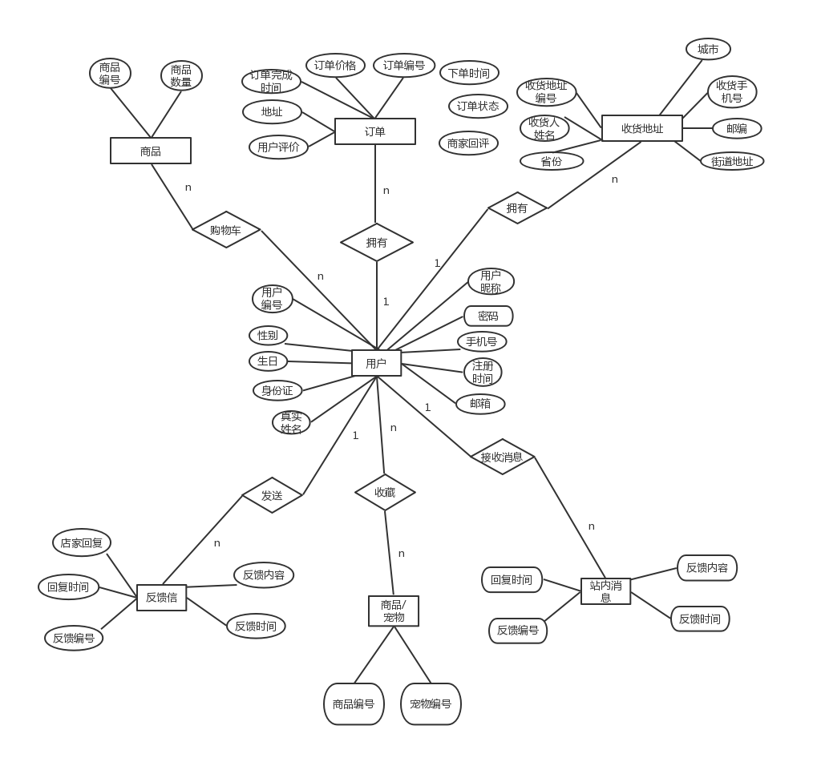
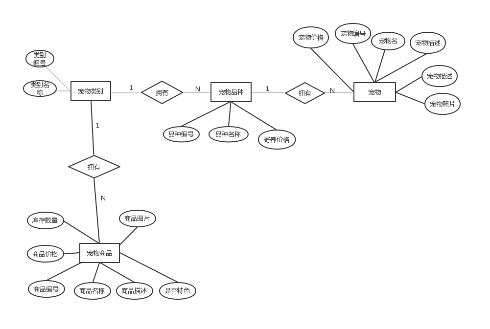

# 网上宠物商城数据库设计

## 数据表设计

### user表（用户表）

|     字段      |    类型     |    标识    |   描述   |
| :-----------: | :---------: | :--------: | :------: |
|      u_id      |     int     |    主键    | 用户编号 |
|   user_name   | varchar(50) | 唯一，非空 | 用户昵称 |
|   password    | varchar(50) |    非空    | 登录密码 |
| phone_number  |  varchar(50)  |    唯一    |  手机号  |
| register_time | varchar(50) |  系统时间  | 注册时间 |
|  email   |       varchar(50)       |      |   邮箱   |
| realname |       varchar(50)       |      | 真实姓名 |
|  idcard  |       varchar(50)       |      |  身份证  |
|   sex    | enum('男','女'，‘其他’) |      |   性别   |
| birthday | date | | 生日 |
| last_login_time | datetime | | 上次登录时间 |

### admin(管理员表)

|  字段  |    类型     | 标识 |    描述    |
| :----: | :---------: | :--: | :--------: |
|  a_id  |     int     | 主键 | 管理员编号 |
| a_name | varchar(50) |      | 管理员昵称 |
| a_pwd  | varchar(50) |      | 管理员密码 |

### shipping_address表（收货地址表）

|         字段          |     类型     | 标识  |      描述      |
| :-------------------: | :----------: | :---: | :------------: |
|         sa_id         |     int      | 主键  |  收货地址编号  |
|         u_id          |     int      | 外键  |    用户编号    |
|     receiver_name     | varchar(50)  | 非空  |   收货人姓名   |
|        address        | varchar(100) | 非空  |   收货 地址    |
|       postcode        | varchar(50)  |       |      邮编      |
| receiver_phone_number | varchar(50)  | 非空  |  收货人手机号  |
|      is_default       |     bit      | 默认0 | 是否为默认地址 |

### pet_category(宠物大类表)

|     字段      |    类型     |    标识    |     描述     |
| :-----------: | :---------: | :--------: | :----------: |
|     pc_id     |     int     |    主键    | 宠物大类编号 |
| category_name | varchar(50) | 非空，唯一 | 宠物大类名称 |

### pet_variety(宠物品种表)

|        字段        |    类型     |    标识    |       描述       |
| :----------------: | :---------: | :--------: | :--------------: |
|       pv_id        |     int     |    主键    |   宠物品种编号   |
|       pc_id        |     int     |    外键    |   宠物大类编号   |
|      pv_name       | varchar(50) | 非空，唯一 |     品种名称     |
| foster_daily price |   double    |    非空    | 寄养价格（每天） |

### pet(宠物表)

|    字段    |     类型     | 标识 |       描述       |
| :--------: | :----------: | :--: | :--------------: |
|    p_id    |     int      | 主键 |     宠物编号     |
|   pv_id    |     int      | 外键 | 所属宠物品种编号 |
|   uo_id    |     int      | 外键 |     订单编号     |
|   p_name   | varchar(50)  | 非空 |      宠物名      |
| p_describe | varchar(200) |      |     宠物描述     |
|  p_price   |    double    | 非空 |     宠物价格     |
|  p_image   | varchar(50)  |      |     宠物照片     |

### pet_product(宠物相关商品表)

|         字段         |     类型     |    标识    |     描述     |
| :------------------: | :----------: | :--------: | :----------: |
|        pp_id         |     int      |    主键    | 宠物商品编号 |
|        pc_id         |     int      |    外键    | 所属宠物大类 |
|       pp_name        | varchar(50)  | 非空，唯一 |   商品名称   |
|     pp_descripe      | varchar(200) |            |   商品描述   |
|       pp_price       |    double    |    非空    |   商品价格   |
|     pp_quantity      |     int      |    非空    |   库存数量   |
|       pp_image       | varchar(50)  |            |   商品图片   |
| is_featured_products |     bit      |   默认0    | 是否特色产品 |

### order(订单表)

|         字段          |     类型     | 标识 |       描述        |
| :-------------------: | :----------: | :--: | :---------------: |
| uo_id | varchar(50) | 主键 | 订单编号(以时间为内容) |
|         u_id          |     int      | 外键 |     用户编号      |
|      order_time       |   datetime   | 非空 |     下单时间      |
|     order_status      |     enum('交易取消'，’等待付款‘，’未发货‘，’已发货‘，’已完成‘)     | 默认“等待。” |     订单状态      |
| order_completion_time |   datetime   |      |   订单完成时间    |
|    payment_method    | enum('支付宝，’微信') | 默认支付宝 |   付款方式    |
|   shipping_address    | varchar(200) |      | 收货地址/上门地址 |
|     user_reviews      | varchar(300) |      |     用户评价      |
|      store_reply      | varchar(300) |      |     商家回评      |

说明：订单表包括商品订单和宠物领养和寄养订单

### order_product(订单商品表)

|       字段        | 类型 | 标识 |     描述     |
| :---------------: | :--: | :--: | :----------: |
|       op_id       | int  | 主键 | 订单商品编号 |
|       uo_id       | int  | 外键 |   订单编号   |
|       pp_id       | int  | 外键 | 宠物商品编号 |
| purchase_quantity | int  | 非空 |   购买数量   |

### user_cart_product(用户购物车商品表)

|   字段   | 类型 | 标识 |     描述     |
| :------: | :--: | :--: | :----------: |
|  ucp_id  | int  | 主键 |     编号     |
|   u_id   | int  | 外键 |   用户编号   |
|  pp_id   | int  | 外键 | 宠物商品编号 |
| quantity | int  | 非空 |     数量     |

### pet_foster_order(宠物寄养订单表)

|    字段    | 类型 | 标识 |        描述        |
| :--------: | :--: | :--: | :----------------: |
|   pfo_id   | int  | 主键 |  宠物寄养订单编号  |
|    o_id    | int  | 外键 |      订单编号      |
|   pv_id    | int  | 外键 | 要寄养的宠物的品种 |
|  quantity  | int  | 非空 | 该品种宠物寄养数量 |
| start_date | date | 非空 |      开始日期      |
|  end_date  | date | 非空 |      结束日期      |

### user_feedback(用户反馈表)

|       字段       |     类型     |    标识    |     描述     |
| :--------------: | :----------: | :--------: | :----------: |
|      uf_id       |     int      |    主键    | 用户反馈编号 |
|       u_id       |     int      |    外键    |   用户编号   |
| feedback_content | varchar(300) |    非空    |   反馈内容   |
|   feedbck_time   |   datetime   | 创建时时间 |   反馈时间   |
|   store_reply    | varchar(300) |            |   店家回复   |
|    reply_time    |   datetime   |            |   回复时间   |

### product_favorites(商品收藏表)

| 字段  | 类型 | 标识 |     描述     |
| :---: | :--: | :--: | :----------: |
| pf_id | int  | 主键 | 商品收藏编号 |
| u_id  | int  | 外键 |   用户编号   |
| pp_id | int  | 外键 | 宠物商品编号 |

pet_favorites(宠物收藏表)

| 字段  | 类型 | 标识 |     描述     |
| :---: | :--: | :--: | :----------: |
| pf_id | int  | 主键 | 宠物收藏编号 |
| u_id  | int  | 外键 |   用户编号   |
| pp_id | int  | 外键 |   宠物编号   |

### station_news(全站消息表)

|    字段    |     类型     |    标识    |     描述     |
| :--------: | :----------: | :--------: | :----------: |
|   sn_id    |     int      |    主键    | 全站消息编号 |
| sn_content | varchar(300) |    非空    |   消息内容   |
|  sn_time   |   datetime   | 创建表时间 |   发布时间   |

### message(消息表)

|   字段    |     类型     |    标识    |           描述           |
| :-------: | :----------: | :--------: | :----------------------: |
|   m_id    |     int      |    主键    |         消息编号         |
|   u_id    |     int      |    外键    | 用户编号（消息接收对象） |
| m_content | varchar(300) |    非空    |         消息内容         |
|  m_time   |   datetime   | 创建表时间 |         发送时间         |
| m_status  |     bit      |   默认0    |        已读/未读         |

### coupon_code(优惠码表)

|     字段     |    类型     | 标识  |    描述    |
| :----------: | :---------: | :---: | :--------: |
|    cc_id     |     int     | 主键  | 优惠码编号 |
|     code     | varchar(50) | 非空  |   优惠码   |
|   discount   |     int     | 非空  |    折扣    |
| is_effective |     bit     | 默认1 |  是否有效  |

## ER图

### 用户

- 用户与收货地址：一对多
- 用户与订单：一对多
- 用户与购物车商品：多对多
- 用户与反馈消息：一对多
- 用户与消息：一对多
- 用户与收藏夹宠物：多对多
- 用户与收藏夹宠物商品：多对多

### 宠物、宠物类别、宠物品种、收藏夹

- 宠物类别与宠物品种：一对多

- 宠物品种与宠物：一对多

- 宠物类别与宠物商品：一对多

  

  

### 订单

- 订单与商品：多对多
- 订单与寄养宠物的品种：多对多
- 订单与领养的宠物：一对多

## 功能模块思维导图

# 功能需求文档

## 管理员模块（钟红梅）

### 管理员登陆界面

- 注册：后台固定分配账号密码（不提供注册）
- 管理员登录
  - 管理人员输入账号、密码，验证账号是否存在
    - 验证不成功：提示账号不存在，弹出继续输入和退出页面
    - 验证成功：进入管理员页面(会员查询、管理商品、订单处理、发送站内消息)

### 管理会员

管理注册会员：

- 查询会员：可以根据会员ID或者会员姓名，查询会员信息(显示用户ID、用户名、真实姓名、联系地址、联系电话、订单记录、浏览记录)

- 回收删除会员：长期未登录用户，可以进行回收账号处理。

### 管理商品

对商品进行有效的管理：

- 商品上架(增)：输入需要添加的商品信息，点击提交向后台数据库提交信息。提交成功的话，页面显示新商品信息提交成功，否则显示提交失败。
- 商品下架(删)：删除商品信息，页面显示删除成功或者失败。
- 商品描述信息改动(改)：成功显示更新的商品信息，否则显示失败
- 输入关键字查询商品(查)：输入商品名称或者类别显示相关信息

### 处理订单

可以对订单进行处理：

- 查看订单：页面显示已接到的订单，其中包含商品名称、商品类别、单价、数量、金额、总金额、下单时间、下单时IP、用户备注、是否付款。选择处理订单或者退出系统。
- 订单确认：改变订单状态，给客户发提醒消息
- 订单处理：发货或者退货，更新订单付款、出货状态
- 订单售后：对用户评价进行回复处理

### 发送站内消息

- 发送全站消息：
  - 发送全站公告，如优惠活动
- 单独给个人用户发送消息：
  - 订单确认
  - 评价回复
  - 商品推荐

## 用户模块（贺涛）

### 1.注册：

- 用户名 -- 字母、数字、汉字组成，不能含有特殊字符，区分字母大小写，长度不超过10个字符，注册时检验是否已经注册

- 密码 -- 字母、数字、特殊符号组成，不能含有汉字，长度8-16个字符，区分字母大小写，页面显示可以明文暗文切换，存库时使用hash-MD5技术加密

- 人机校验 -- 根据动图显示框里的内容，在文本框跳入正确内容；完成即通过，否则，反之手机验证码 -- 首先需验证手机号是否为国内手机号11位，然后通过给用户注册手机号发送验证码，输入成功可登录，另还是验证次手机号是否已经注册

### 2.登录：

- 用户名密码登录：验证账号密码，账号不存在或者密码错误给出统一提示信息‘用户名或密码错误’；手机验证码动态登录，验证手机号是否存在，不存在提示，手机不存在，请注册

- 下次自动登录按钮：用户在第一次登录时，点击下次自动登录，下次不用输入密码，自动登录

- 登录：验证用户名和密码成功后，点击登录，进入网页主页面

- 忘记密码：用户点击之后，进入找回密码页面，通过注册时手机验证，重新输入密码

### 3.个人中心

- 帐号管理：完善个人资料、修改密码、修改手机、修改邮箱、修改收货地址、添加收货地址、登录日志、帐号注销

- 我的收藏：点击跳转到收藏页面

- 购物车 -- 点击跳转到购物车页面

- 订单管理 -- 点击跳转到订单管理页面

- 消息中心：点击查看消息

## 购物模块

1. 分类展示，关键字搜索等
2. 商品购物车，支付功能
3. 宠物领养，宠物寄养

## 客服模块

1. 人工客服：网页形式，实时对话
2. 智能客服：使用AI自动回复一些常见的问题 

